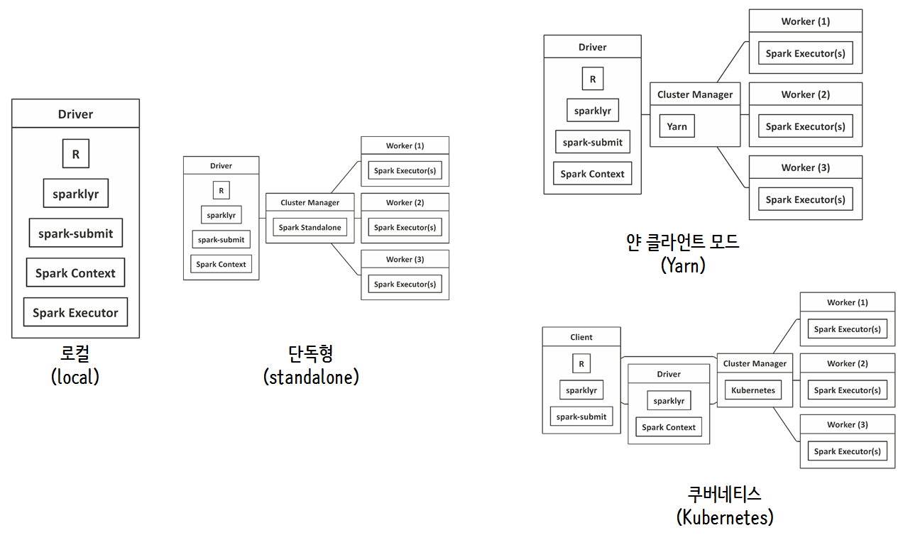

``` {r, include=FALSE}
# source("tools/chunk-options.R")
knitr::opts_chunk$set(echo = TRUE, warning=FALSE, message=FALSE,
                    comment="", digits = 3, tidy = FALSE, prompt = FALSE, fig.align = 'center')
```

# AWS 아파치 스파크 클러스터 [^the-r-in-spark] [^aws-emr-sparklyr] [^aws-emr-dryrun] {#aws-spark-dryrun}


[^the-r-in-spark]: [Javier Luraschi, Kevin Kuo, Edgar Ruiz(2018), "The R in Spark: Learning Apache Spark with R"](https://therinspark.com/)
[^aws-emr-sparklyr]: [sparklyr from Rstudio, "Using sparklyr with an Apache Spark cluster"](https://spark.rstudio.com/examples/yarn-cluster-emr/)
[^aws-emr-dryrun]: [Analyzing 4 Billions of Tags with R and Spark](http://rstudio-pubs-static.s3.amazonaws.com/241700_a369cda6066340388b2a7c1452cbb831.html)

로컬에 스파크 클러스터를 만드는 경우 `Spark Executor`가 로컬 컴퓨터에 위치하게 되고, 그외의 경우 `Cluster Manager`를 `Spark Standalone`, `Yarn`, `Kubernetes`로 두게 되고 쿠버네티즈는 확장성을 위해서 클라이언트와 드라이버가 분리되는 아키텍처를 취하게 된다.



# 로컬(local) 스파크 클러스터 {#aws-spark-dryrun-local}

[로컬 스파크 설치 - PC/노트북, EC2 원격 컴퓨터](https://statkclee.github.io/bigdata/ds-sparklyr.html)를 참조하여 로컬(local) 스파크를 설치한다. `sparklyr` 팩키지 `spark_home_dir()`, `spark_installed_versions()` 함수를 사용해서 R에서 스파크 설정에 관련된 정보를 파악하고 스파크 클러스터를 생성한 후 `spark_version()`을 확인한다.

```{r spark-cluster-setup}
# 1. 라이브러리
library(sparklyr)
library(tidyverse)

## 설치된 SPARK 버젼확인 설정
# Sys.getenv("SPARK_HOME")
# spark_home_dir()
# spark_installed_versions()

# 2. 스파크 클러스터 연결
sc <- spark_connect(master="local")

## 2.1. 스파크 버젼 확인
spark_version(sc=sc)

# 3. 스파크 연결해제
# spark_disconnect(sc=sc)
```


# 스파크 시운전(dryrun)  {#aws-spark-dryrun-one-million}

빅데이터를 스파크 클러스터에서 처리하는 것은 기술적으로도 난이도가 PC 로컬에서 작업하는 것보다 높은 것은 사실이지만 비용도 만만치 않게 많이 들 수 있다. 이런 문제로 인해서 로컬 컴퓨터에 스파크 클러스터를 생성하여 1% 랜덤 추출할 데이터를 집어넣어 다양한 분석과 모형개발작업을 수행한 뒤에 AWS 클라우드에 올려 본작업을 수행하는 것이 일반적인 작업흐름이다.


## 백만곡(One Million Song) 데이터셋 [^million-song-dataset] [^one-million-song-uci] {#aws-spark-dryrun-standalone}

[^million-song-dataset]: [Million Song DatasetMillion Song Dataset](https://labrosa.ee.columbia.edu/millionsong/pages/getting-dataset)

[^one-million-song-uci]: [UCI Machine Learning Repository, "YearPredictionMSD Data Set"](http://archive.ics.uci.edu/ml/datasets/YearPredictionMSD)


[백만곡(One Million Song) 데이터셋](https://labrosa.ee.columbia.edu/millionsong/pages/getting-dataset) 데이터셋은 300GB 로 대용량 데이터셋이라 1% 임의 추출하여 크기를 대폭줄인 1.8GB [MILLION SONG SUBSET](http://static.echonest.com/millionsongsubset_full.tar.gz)도 존재한다.
[UCI Machine Learning Repository, "YearPredictionMSD Data Set"](http://archive.ics.uci.edu/ml/datasets/YearPredictionMSD) 데이터셋도 크기가 작아 분석을 시작하기에 적합하다. `YearPredictionMSD` 데이터를 다운로드 받으면 `YearPredictionMSD.txt.zip` 파일이 생성되고 크기는 약 200 MB정도 된다. 압축을 풀게되면 438MB 정도로 크기가 커진다. 


## 로컬 스파크 데이터 분석  {#aws-spark-dryrun-local-analysis}

[YearPredictionMSD.txt.zip](http://archive.ics.uci.edu/ml/machine-learning-databases/00203/YearPredictionMSD.txt.zip) 파일을 `download.file()` 함수로 `YearPredictionMSD.txt.zip` 파일로 다운로드 받아 저장하고 `unzip()`으로 압축을 푼다.

스파크 클러스터로 데이터를 가져오기 위해서 먼저 `spark_read_csv()` 함수로 다운로드받은 데이터를 가져온다. 그리고 나서 `class()` 함수로 자료형을 확인한다. "tbl_spark"로 확인 되었으니 `dplyr` 동사를 활용하여 자유로이 데이터 분석을 수행한다. 우선 표본 1%를 뽑아 백만곡이 출시된 연도를 뽑아서 히스토그램을 그려본다. 스파크 RDD를 `collect()` 함수로 로컬 컴퓨터로 데이터프레임으로 가져온 후 `ggplot()` 함수로 시각화한다.

```{r spark-cluster-input-analysis}
## 데이터 다운로드
# download.file("http://archive.ics.uci.edu/ml/machine-learning-databases/00203/YearPredictionMSD.txt.zip", destfile ="data/YearPredictionMSD.txt.zip")

# unzip("data/YearPredictionMSD.txt.zip")

## 데이터 스파크 클러스터로 불러오기
msd_rdd <- spark_read_csv(sc, "msd", "data/YearPredictionMSD.txt", repartition = 0, memory = TRUE,  overwrite = TRUE, header = FALSE)

## 자료형 확인
class(msd_rdd)

## 스파크 RDD를 데이터프레임으로 변환시킨 후에 `ggplot()`으로 시각화
library(extrafont)
loadfonts()

msd_rdd %>% 
  sample_frac(0.01) %>% 
  select(V1) %>% 
  collect() %>%
  ggplot(aes(x=V1)) +
    geom_histogram(binwidth = 1) +
    theme_minimal(base_family = "NanumGothic") +
    labs(x="", y="발매곡수", title="연도별 발매곡수", subtitle="출처: UCI 백만곡 표본추출 데이터")
```


