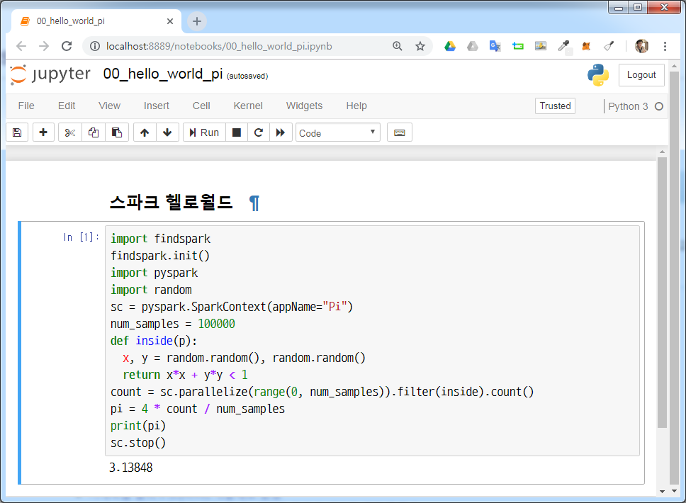

``` {r, include=FALSE}
# source("tools/chunk-options.R")
knitr::opts_chunk$set(echo = TRUE, warning=FALSE, message=FALSE,
                    comment="", digits = 3, tidy = FALSE, prompt = FALSE, fig.align = 'center')
```

# 쥬피터 노트북 {#jupyter-notebook-configure}

쥬피터 노트북으로 작업하는 경우 두가지가 마음에 걸린다. 첫번째는 작업 디렉토리 설정이고 그 다음으로 한글폰트 설정이다.

## 작업 디렉토리 설정 [^jupyter-notebook-working-directory] {#jupyter-notebook-directory}

[^jupyter-notebook-working-directory]: [path - 주피터 노트북 테마 - Jupyter 시작 폴더를 변경하는 방법](https://code.i-harness.com/ko-kr/q/219f244)

스파크 클러스터에 접근라는데 개발환경을 쥬피터 노트북으로 설정하고 작업 디렉토리를 설정한다.
이를 위해서 `cmd` (또는 Anaconda Prompt )를 열고 `jupyter notebook --generate-config` 실행하여 
`jupyter_notebook_config.py` 파일을 생성하고 디렉토리 환경설정부분을 다음과 같이 텍스트 편집기를 열어
변경시킨다.


<div class = "row">
  <div class = "col-md-6">
**`jupyter_notebook_config.py` 변경전**

``` {r jupyter-notebook-before, eval=FALSE}
#c.NotebookApp.notebook_dir = ''
```

  </div>
  <div class = "col-md-6">
**`jupyter_notebook_config.py` 변경후**

``` {r jupyter-notebook-after, eval=FALSE}
## The directory to use for notebooks and kernels.
# c.NotebookApp.notebook_dir = '/the/path/to/home/folder/'
c.NotebookApp.notebook_dir = 'D:\\tidyverse\\bigdata\\code'
```

  </div>
</div>

## 한글 폰트 설정 [^hangul-font-setup] {#jupyter-notebook-directory-hangul}

[^hangul-font-setup]: [frhyme.code, "jupyter notebook 커스토마이징하기"](https://frhyme.github.io/python-lib/jupyter_notebook_font_change/)

쥬피터 노트북을 설치하면 `C:\Users\<사용자ID>\.jupyter`가 생성된다. 여기에 `custom.css` 파일을 생성시키고 적용하고자하는 폰트를 설정하면 된다.

1. 윈도우 탐색기를 연다.
1. `C:\Users\<사용자ID>\.jupyter` 디렉토리로 이동한다.
1. `custom` 디렉토리를 생성한다.
1. `custom.css` 파일을 생성한다.
1. 다음 내용을 `custom.css` 파일에 적어 저장시킨다.

`D2Coding` 폰트를 사전에 다운로드 받아 설치하고 나서 윈도우 시스템에 설치된 `D2Coding` 폰트를 쥬피터 노트북에 적용시키는 개념이다.

``` {r custom-css, eval=FALSE}
.CodeMirror pre {font-family: D2Coding; font-size: 12pt; line-height: 140%;}
.container { width:100% !important; }
div.output pre{
    font-family: D2Coding;
    font-size: 12pt;
}
```




# 스파크 클러스터 접속 {#sparkcontext-connect}

스파크 클러스터가 생성되면, 이에 접근할 수 있는 지점이 필요한데 이를 `SparkContext`라고 부른다.
스파크 컨텍스트(Spark Context)를 통해 스파크 클러스터에 접근하여 필요한 명령어를 전달하고 실행결과를 전달받게 된다.
통상 줄여서 `SparkContext`를 `sc` 변수로 지칭한다.


`findspark` 팩키지를 통해서 스파크를 찾아내고 `pyspark.SparkContext` 명령어로 스파크 접속지점을 특정한다.
`sc` 변수를 통해 스파크 버젼, 파이썬 버전, 마스터 정보를 확인한다.

``` {r pyspark-sparkcontext, eval=FALSE}
import findspark
findspark.init()
import pyspark

# sc = pyspark.SparkContext(appName="SparkContext")
sc = pyspark.SparkContext()

# SparkContext 버전
print("스파크 컨텍스트 버젼: ", sc.version)

# SparkContext 파이썬 버전
print("Spark Context 파이썬 버전:", sc.pythonVer)

# SparkContext 마스터
print("Spark Context 마스터:", sc.master)

# 출력결과 -----------------------
스파크 컨텍스트 버젼:  2.3.0
Spark Context 파이썬 버전: 3.6
Spark Context 마스터: local[*]
```

# 스파크 클러스터로 데이터 가져오기 {#sparkcontext-import}

스파크 클러스터로 분석을 위한 데이터를 가져오는 방식은 크게 두가지로 나눈다.

## `sc.parallelize` {#sparkcontext-import-parallelize}

`sc.parallelize()` 함수로 파이썬 리스트를 스파크 클러스터로 가져오는 코드는 다음과 같다.
파이썬 리스트가 스파크 `RDD`로 변환된 것을 확인할 수 있다.

```{r pyspark-import, eval=FALSE}
seq_number = range(1, 100)

# PySpark으로 리스트 데이터 가져오기
spark_data = sc.parallelize(seq_number)

print(spark_data)

# 출력결과 -----------------------
PythonRDD[1] at RDD at PythonRDD.scala:48
```


## `sc.textFile` {#sparkcontext-import-textFile}

`sc.textFile()` 함수로 외부 텍스트 데이터를 스파크 클러스터로 가져오는 코드는 다음과 같다.
`iris.csv` 파일이 스파크 `RDD`로 변환된 것을 확인할 수 있다. `iris_partition_rdd.getNumPartitions()` 함수로 몇조각으로 파티션이 나뉘었는지도 확인할 수 있다. 

```{r pyspark-import-textFile, eval=FALSE}
iris = sc.textFile("../data/iris.csv")
print(iris)
# 출력결과 -----------------------
../data/iris.csv MapPartitionsRDD[5] at textFile at <unknown>:0
```


# 한걸음더 들어갑니다. {#sparkcontext-import-step-forward}

텍스트 리스트를 `sc.parallelize()` 함수로 데이터를 가져온다. 그리고 나서 `type()` 명령어로 자료형이 RDD라는 사실을 확인한다.
`sc.textFile()` 함수로 외부 `.csv` 데이터를 가져올 경우 `minPartitions`인자를 설정하여 원본 데이터, 즉 빅데이터를 몇조각으로 나눌지 지정할 수 있다. 

```{r pyspark-import-set-forward, eval=FALSE}
# 단어 리스트를 바탕으로 RDD 객체 생성
list_rdd = sc.parallelize(["빅데이터는", "스파크로", "스몰 데이터는", "데이터프레임으로"])
# RDD 자료형 확인
print("RDD 자료형: ", type(list_rdd))

# 출력결과 -----------------------
The type of RDD is <class 'pyspark.rdd.RDD'>
  
# 단어 리스트를 바탕으로 파티션 반영 RDD 객체 생성
iris_partition_rdd = sc.textFile("../data/iris.csv", minPartitions=3)
# RDD 자료형 확인
print("RDD 자료형: ", type(iris_partition_rdd), "\n파티션 갯수:", iris_partition_rdd.getNumPartitions())

# 출력결과 -----------------------
RDD 자료형:  <class 'pyspark.rdd.RDD'> 
파티션 갯수: 3
```
