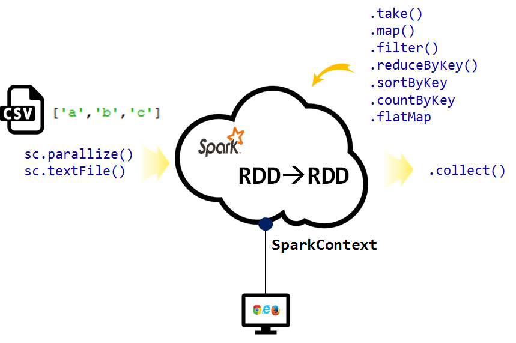

``` {r, include=FALSE}
# source("tools/chunk-options.R")
knitr::opts_chunk$set(echo = TRUE, warning=FALSE, message=FALSE,
                    comment="", digits = 3, tidy = FALSE, prompt = FALSE, fig.align = 'center')
```

# RDD 자료변환 개요 {#pyspark-rdd-transformation-overview}

`sc.parallelize()` 혹은 `sc.textFile()` 함수로 리스트나 외부 `.csv` 혹은 텍스트 파일을 스파크로 불러들인 후에 
`.take()`, `.map()`, `.filter()`, `.reduceByKey()`, `.sortByKey()`, `.countByKey()`, `.flatMap()` 함수를 활용하여 원하는 형태 데이터로 가공을 시킨다. 그리고 나서 다시 `.collect()`함수로 스파크 RDD를 뽑아낸다.



R 마크다운에서 `pyspark` 명령어를 돌릴 수 있도록 `reticulate`를 활용하여 파이썬 언어를 사용하도록 준비한다.

```{r setup-python}
library(reticulate)
use_condaenv("anaconda3")
```


# RDD 변환 기초 {#pyspark-rdd-transformation-list}

## 리스트 RDD 변환 {#pyspark-rdd-transformation-list}

파이썬 리스트 데이터 객체(`[1,2,3,4,5]`)를 스파크 RDD로 클러스터에 올린 후에 `.map()` 함수로 연산작업을 수행한다. 그리고 나서 다시 스파크에서 파이썬으로 RDD 객체를 빼내는데 `.collect()` 함수를 사용해서 가져오고 이를 `for` 문을 돌려 제곱 연산이 제대로 되었는지 확인한다.

```{python pyspark-rdd-map-list}
import findspark
findspark.init()
import pyspark

sc = pyspark.SparkContext()

# 숫자 리스트를 바탕으로 RDD 객체 생성
list_rdd = sc.parallelize([1,2,3,4,5])

```


```{r pyspark-rdd-map-list-output, eval=FALSE}
list_squared_rdd = list_rdd.map(lambda x: x**2)
list_squared_list = list_squared_rdd.collect()

for element in list_squared_list:
    print("원소를 제곱한 값: ", element)

# 출력결과 -------------
원소를 제곱한 값:  1
원소를 제곱한 값:  4
원소를 제곱한 값:  9
원소를 제곱한 값:  16
원소를 제곱한 값:  25
```


## 외부 데이터 리스트 RDD 변환 {#pyspark-rdd-transformation-csv}

`iris.csv` 외부 `.csv` 데이터를  `sc.textFile()` 함수로 불러와서 RDD 객체로 변환시킨다.
람다 무명함수로 `.filter`를 걸어 "setosa"가 포함된 모든 행을 뽑아내서 `iris_setosa_rdd` RDD 객체를 생성시킨다.
그리고 나서 `.count()` 함수로 "setosa"가 포함된 행을 센다. `.take()` 함수로 스파크 클러스터에서 빼내서 `for`문을 돌려 "setosa"가 포함된 7줄을 뽑아내서 출력시킨다.

```{python pyspark-rdd-map-csv}
iris_rdd = sc.textFile("data/iris.csv")

# "setosa" 품종이 포함된 행만 필터를 걸어서 추출함.
iris_setosa_rdd = iris_rdd.filter(lambda species: "setosa" in species)
```

```{r pyspark-rdd-map-csv-output, eval=FALSE}
# "setosa" 품종이 포함된 행수를 개수함.
print("IRIS 데이터 setosa 품종수: ", iris_setosa_rdd.count())

# 첫 7행을 화면에 출력시킴
for species in iris_setosa_rdd.take(7): 
  print(species)

# 출력결과 -------------
IRIS 데이터 setosa 품종수:  50
5.1,3.5,1.4,0.2,setosa
4.9,3.0,1.4,0.2,setosa
4.7,3.2,1.3,0.2,setosa
4.6,3.1,1.5,0.2,setosa
5.0,3.6,1.4,0.2,setosa
5.4,3.9,1.7,0.4,setosa
4.6,3.4,1.4,0.3,setosa
```

# 다양한 RDD 변환 방법 {#pyspark-rdd-transformation-in-practice}

## 파이썬 딕셔너리 활용 {#pyspark-rdd-in-practice-key-value-python}

튜플 리스트로 데이터가 준비된 경우 각 정당별(key) 득표수(value)에 대한 합을 구하는 경우, 
스파크 클러스터를 활용하지 않고 데이터가 작은 경우 `defaultdict()` 함수를 활용해서 계산하는 것이 가능하다.

```{python key-value-dictionary}
from collections import defaultdict

# 튜플 리스트
party_list = [('민주당',1), ('바른미래',2), ('자유한국',3), ('민주당',30), ('바른미래',20), ('자유한국',10)]

party_dict = defaultdict(int)

# 정당별 합을 구하는 과정
for party, vote in party_list:
    party_dict[party] += vote

# 정당별 합을 출력
for party, vote in party_dict.items():
    print(party, ":", vote)
```


## 스파크 RDD `reduceByKey()` 함수 {#pyspark-rdd-in-practice-key-value-spark}

튜플 리스트를 스파크에 넣어 RDD로 변환시킨 후에 `reduceByKey()`함수를 사용해서 키값을 기준으로 값(Value)에 대한 연산작업을 수월히 수행할 수 있다.


```{r key-value-rdd, eval=FALSE}
party_rdd = sc.parallelize(party_list)

# 정당별 총합 계산
party_total_rdd = party_rdd.reduceByKey(lambda x, y: x+y).sortByKey(ascending=True)

# 정당별 총합을 계산하고 내림차순으로 정렬
for num in party_total_rdd.collect():
  print(num)
```

```{r key-value-rdd-output, eval=FALSE}
# 출력결과 -------------
('민주당', 31)
('바른미래', 22)
('자유한국', 13)
```

## 판다스 데이터프레임 변환 {#pyspark-rdd-in-practice-key-value-pandas}

튜플 리스트를 `pd.DataFrame()` 함수로 판다스 데이터프레임으로 변환을 시킨 후에 `groupby()` 연산을 사용해서 정당별 득표수 합을 구한다.

```{python key-value-pandas}
import pandas as pd

party_df = pd.DataFrame(party_list, columns=['party', 'vote'])

print(party_df.groupby('party').sum())
```