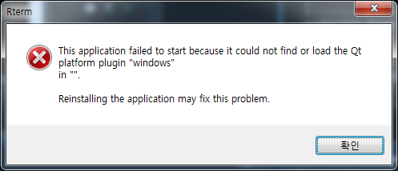

``` {r, include=FALSE}
# source("tools/chunk-options.R")
knitr::opts_chunk$set(echo = TRUE, warning=FALSE, message=FALSE,
                    comment="", digits = 3, tidy = FALSE, prompt = FALSE, fig.align = 'center')
```

# 데이터 추상화 {#pyspark-rdd-abstraction}

(빅)데이터를 앞서 RDD로 추상화한 후에 다양한 함수형 프로그래밍 기법을 사용해서 데이터 변환연산 작업을 수행하였다.
목적이 기계학습 예측모형을 개발하는 경우 RDD 데이터보다는 이를 추상화한 데이터프레임으로 작업하는 것이 수월한 경우가 많다.
크게 스파크 데이터프레임 동사를 학습하여 이를 적용하는 방식과 SQL 구문을 작성하여 작업하는 두가지 방식이 많이 사용된다.

R마크다운에서 `pyspark`를 사용할 수 있도록 `reticulate` 팩키지 환경을 설정한다.

```{r setup-python}
library(reticulate)
use_condaenv("anaconda3")
```

생성된 스파크에 접속할 수 있도록 변수를 생성시킨다.

```{python initialize-spark-cluster}
import findspark
import findspark
findspark.init()

from pyspark import SparkContext
from pyspark.sql import SQLContext
import pandas as pd

sc = SparkContext('local','abstract_data')  # if using locally
spark = SQLContext(sc)
```

# 데이터프레임 생성 {#pyspark-rdd-abstraction-dataframe}
## 리스트 &rarr; 스파크 데이터프레임으로 변환 {#pyspark-rdd-abstraction-df-conversion}

튜플 리스트를 `spark.createDataFrame` 함수로 스파크 데이터프레임을 생성시킨다.

```{python list-tuple-dataframe}
# 튜플 리스트
party_list = [('민주당',1), ('바른미래',2), ('자유한국',3), ('민주당',30), ('바른미래',20), ('자유한국',10)]
# 튜플리스트에서 RDD생성 
party_rdd = sc.parallelize(party_list)

# 스파크 데이터프레임 생성
# party_df = spark.createDataFrame(party_rdd, schema=['정당', '득표수'])

# 자료형 확인
# print("party_df 자료형: ", type(party_df))

# party_df.show()
```

## `.csv` 파일을 스파크 데이터프레임으로 변환 {#pyspark-rdd-abstraction-df-csv}

`iris.csv` 파일을 스파크 데이터프레임으로 변환시킨다. 이를 위해서 `.read.csv()` 함수를 사용하고 `.printSchema()`메쏘드로 데이터프레임 변수별 자료형을 확인할 수 있다.

```{python list-tuple-dataframe-csv}
# Create an DataFrame from people.csv file
iris_df = spark.read.csv("data/iris.csv", header=True, inferSchema=True)

# Print the schema of the DataFrame
iris_df.printSchema()
```

# 스파크 데이터프레임 변환작업 {#pyspark-rdd-abstraction-df-wrangling}

외부 데이터를 가져온 후에 다양한 메쏘드를 활용하여 데이터프레임 변환작업을 수행한다.

```{python list-tuple-dataframe-csv-wrangling}
# 데이터프레임 일반현황
print("데이터프레임 행수: {}".format(iris_df.count()), "\n데이터프레임 열수: {}".format(len(iris_df.columns)), "\n변수명: ", iris_df.columns)
# 데이터프레임 변수 및 행 필터링
iris_subset_df = iris_df.select('sepal_length', 'petal_length', 'species').filter(iris_df.species =="setosa")
# 첫 관측점 10개만 추출
iris_subset_df.show(10)
```


# 스파크 데이터프레임 SQL 변환작업 {#pyspark-rdd-abstraction-df-sql}

외부 데이터를 가져온 후에 SQL 구문을 활용하여 데이터프레임에 대한 변환작업을 수행할 수 있다.


```{python list-tuple-dataframe-csv-wrangling-df}
# iris 테이블 생성 - `iris_df` 스파크 데이터프레임을 콕 집음.
iris_df.createOrReplaceTempView("iris")

# 쿼리를 생성
iris_query = '''SELECT sepal_length, petal_length, species 
                FROM iris 
                WHERE species == "setosa"'''

# 쿼리를 실행시켜 스파크 데이터프레임 객체 신규 생성
iris_query_df = spark.sql(iris_query)

# 스파크 데이터프레임 결과 출력
iris_query_df.show(10)
```


# 데이터프레임 시각화 {#pyspark-rdd-abstraction-df-sql-spark-viz}

시각화를 위해서 스파크 데이터프레임을 판다스 데이터프레임으로 변환시켜야 된다. 이를 위해서 `.toPandas()` 함수를 사용하고 `matplotlib.pyplot`을 사용해서 시각화한다.

```{python list-tuple-dataframe-csv-wrangling-viz}
import matplotlib.pyplot as plt

iris_query_pd = iris_query_df.toPandas()

# 시각화
iris_query_pd.plot(kind='density')
plt.show()
```

## 오류 [^pyqt5-error]  {#pyspark-rdd-abstraction-df-sql-spark-viz-error}

[^pyqt5-error]: [파이썬 GUI 프로그래밍 with PyQt5 (1)](http://doongkibangki.tistory.com/24)

`qt platform plugin windows error`가 팝업창에 나오는 경우 `pyqt5`를 설치함으로써 문제를 해결할 수 있다.

```{r install-pyqt5, eval=FALSE}
> pip install pyqt5
```

 