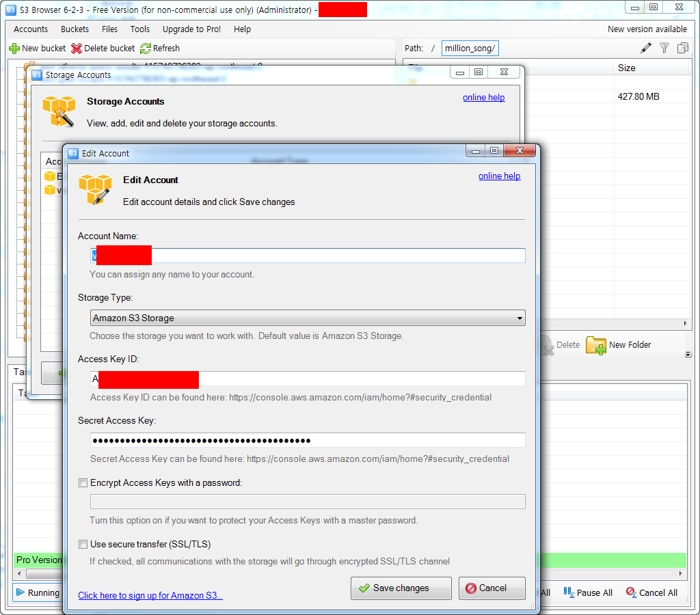
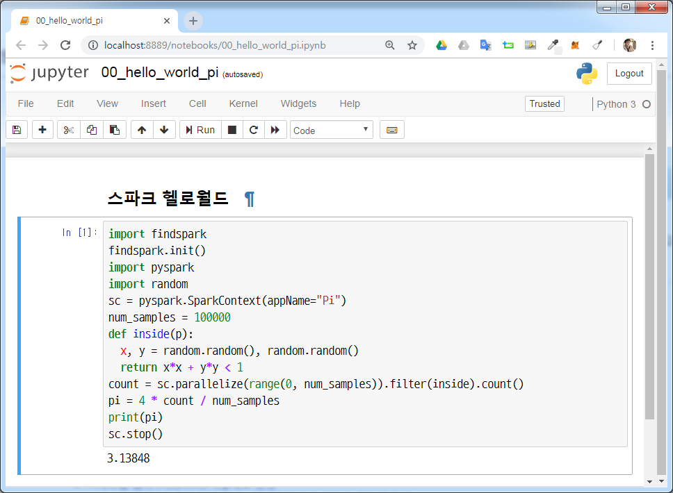

``` {r, include=FALSE}
# source("tools/chunk-options.R")
knitr::opts_chunk$set(echo = TRUE, warning=FALSE, message=FALSE,
                    comment="", digits = 3, tidy = FALSE, prompt = FALSE, fig.align = 'center')
```

# `pyspark` IDE [^pyspark-jupyter] {#spark-pyspark-ide}

[^pyspark-jupyter]: [Charles Bochet (May 2, 2017), "Get Started with PySpark and Jupyter Notebook in 3 Minutes"](https://blog.sicara.com/get-started-pyspark-jupyter-guide-tutorial-ae2fe84f594f)

자바 &rarr; 하둡 &rarr; 스파크를 설치한 후에 `pyspark`를 통해 작업을 수행하는 방식이 스칼라 언어가 아닌 경우 많이 사용되고 있다.
이를 위해서 쥬피터 노트북 같은 IDE가 필요한데 스파크에 `pyspark`을 통해 쥬피터 노트북으로 작업하는 방식을 살펴보자.


스파크에 `pyspark`로 접속하여 분석과 개발작업을 수행하는 방법은 쥬피터 노트북을 사용할 경우 두가지 방식이 존재한다.

- `.bashrc` 파일에 쥬피터 노트북 지정사항 반영
- `findspark` 팩키지를 활용하여 쥬피터 노트북에서 `pyspark` 찾아 반영

## PySpark 드라이버 활용 {#spark-pyspark-ide-env}

`~/.bashrc` 파일에 환경설정 정보 반영하여 `pyspark` 명령어를 실행시키면 웹브라우저에 쥬피터 노트북이 떠 바로 작업하는 방법이 있다.

``` {r pyspark-bashrc, eval=FALSE}
# ~/.bashrc 파일 추가 내용
export PYSPARK_DRIVER_PYTHON=jupyter
export PYSPARK_DRIVER_PYTHON_OPTS='notebook'
```

## `findspark` 팩키지 사용 {#spark-pyspark-ide-jupyter}

`pip install findspark` 명령어로 `findspark`를 설치한다. `jupyter notebook` 명령어 혹은 Anaconda Navigator에서 쥬피터 노트북을 실행한 후에 `import findspark` 명령어로 
팩키지를 활용하는 방식이다. 즉, 쥬피터 노트북을 실행시키고 `import`로 불러와서 처리하는 방법이다.

``` {r findspark-jupyter-notebook, eval=FALSE}
import findspark
findspark.init()
import pyspark
import random
sc = pyspark.SparkContext(appName="Pi")
num_samples = 100000
def inside(p):     
  x, y = random.random(), random.random()
  return x*x + y*y < 1
count = sc.parallelize(range(0, num_samples)).filter(inside).count()
pi = 4 * count / num_samples
print(pi)
sc.stop()
```


# 윈도우 환경 AWS CLI  {#windows-aws-cli}

## 윈도우 비트 확인 [^hp-windows-bit] {#windows-aws-cli-bit}

[^hp-windows-bit]: [HP PC - 내 컴퓨터의 Windows 버전이 32비트입니까 또는 64비트입니까?](https://support.hp.com/kr-ko/document/c02020927)

AWS에 접근하는 로컬 컴퓨터 운영체제가 윈도우의 경우 Microsoft Windows에 AWS Command Line Interface 설치](https://docs.aws.amazon.com/ko_kr/cli/latest/userguide/install-windows.html)에 
따라서 AWS CLI를 설치할 경우 가장 먼저 "Windows용 AWS CLI MSI 설치 관리자"를 다운로드 받아야 하는데 64비트와 32비트가 있다.

1. 윈도우 탐색기를 연다.
1. 좌측 메뉴 `컴퓨터`에 마우스 포인터를 위치시키고 우클릭한다.
1. 메뉴에서 "속성"을 클릭한다.
1. `컴퓨터에 대한 기본 정보 보기` &rarr; `시스템` &rarr; `시스템 종류: 64비트 운영 체제` 

혹은 윈도우 탐색기 상단 주소창에 "제어판\모든 제어판 항목\시스템"을 복사하여 붙여넣으면 `제어판 홈`에서 확인이 가능하다.

## AWS CLI 설치 {#windows-aws-cli-install}

운영체제에 맞춰 64비트 혹은 32비트 Windows용 AWS CLI MSI 설치 관리자를 다운로드 받는다.
[Windows용 AWS CLI MSI 설치 관리자(64비트) 다운로드](https://s3.amazonaws.com/aws-cli/AWSCLI64PY3.msi)받아 설치작업을 한다.

CLI는 기본적으로 `C:\Program Files\Amazon\AWSCLI`(64비트 버전) 또는 `C:\Program Files (x86)\Amazon\AWSCLI` (32비트 버전) 디렉토리에 설치됩니다.

## AWS CLI 설치 환경변수 추가 {#windows-aws-cli-install-path}

AWS CLI를 설치하게 되면 `C:\Program Files\Amazon\AWSCLI`(64비트 버전) 또는 `C:\Program Files (x86)\Amazon\AWSCLI` (32비트 버전) 디렉토리에 실행파일이 위치하게 된다.
쉘에서 AWS CLI를 바로 불러 사용할 수 있도록 등록을 해줘야 한다.
이를 환경변수 설정 작업이라고 한다.

- MSI 설치 관리자(64비트) – C:\Program Files\Amazon\AWSCLI
- MSI 설치 관리자(32비트) – C:\Program Files (x86)\Amazon\AWSCLI

AWS CLI가 설치된 디렉토리가 확인되면 다음으로 환경변수 등록작업을 한다.

1. 윈도우 키(⊞) 를 누르고 "environment variables"을 타이핑한다.
1. 환경변수 창이 뜨는 것을 확인한다.
1. `<유저명>에 대한 사용자 변수(U)`를 확인한다.
1. `변수`에서 **Path**를 선택하고 `편집(E)...`을 클릭한다.
1. 세미콜론으로 구분된 맨 마지막에 "세미콜론"으로 구분되게 64비트의 경우 `C:\Program Files\Amazon\AWSCLI` 경로명을 추가한다.
1. `확인`을 누루고 빠져나온다.

## AWS CLI 설치 확인 {#windows-aws-cli-install-path-confirm}

AWS CLI 설치 작업과 `cmd` 쉘에서 불러 사용할 수 있도록 환경설정 작업이 완료되면 
제대로 설치되어 활용이 가능한지 `cmd` 쉘에서 확인 과정을 거친다.

키보드 윈도우 키(⊞) +  `R` 누르면 실행창이 뜨고 `cmd` 를 타이핑하면 윈도우 쉘 터미널이 실행된다.

현재 컴퓨터 사용자명이 `tidyverse`로 가정하고 `where aws` 명령어로 AWS CLI 가 위치한 곳을 확인하고 
`aws --version` 명령어를 통해 정상 설치되었는지 확인한다.

``` {r aws-cli-tidyverse-windows, eval=FALSE}
Microsoft Windows [Version 6.1.7601]
Copyright (c) 2009 Microsoft Corporation. All rights reserved.

C:\Users\tidyverse> aws --version
aws-cli/1.16.90 Python/3.6.0 Windows/7 botocore/1.12.80

C:\Users\tidyverse> where aws
C:\Program Files\Amazon\AWSCLI\bin\aws.cmd
```

# 윈도우 환경 `aws-shell` [^aws-shell]  {#windows-aws-cli-shell-aws}

[^aws-shell]: [An integrated shell for working with the AWS CLI.](https://github.com/awslabs/aws-shell)

[aws-shell][https://github.com/awslabs/aws-shell]을 설치하여 AWS CLI를 쉽고 편하게 사용할 수 있도록 작업한다.

`pip install aws-shell` 명령어를 통해서 `aws-shell`을 설치한다.

``` {r aws-cli-tidyverse, eval=FALSE}
C:\Users\tidyverse> pip install aws-shell
```

# AWS 키관리  {#windows-aws-cli-key}

AWS CLI를 설치하고 나서 처음 해야 할 일은 `Access Key` 및 `Secret Access Key` 그리고 기본 `리전` 및 `출력 결과`를 설정하는 것입니다. 
이유는 `Access Key` 및 `Secret Access Key` 정보만 있으면 누구나 AWS 클라우드 자원을 마음먹은대로 사용할 수 있기 때문이다.


- AWS Access Key ID [****************BDKA]:
- AWS Secret Access Key [****************zn8W]:
- Default region name [ap-northeast-2]:
- Default output format [None]:

`cmd` 윈도우 쉘에서 `aws configure` 명령어로 AWS `IAM`을 발급한 `AWS Access Key ID`,
`AWS Secret Access Key`를 설정하여 반영시킨다.
`configure list` 명령어를 통해 설정내용을 확인한다.


``` {r aws-cli-tidyverse-key, eval=FALSE}
aws> configure
AWS Access Key ID [****************BDKA]: XXXXXXXXXXXXXXXXXXXX6HOQ
AWS Secret Access Key [****************zn8W]: XXXXXXXXXXXXXXXXXXXXXXXXXhTEf
Default region name [ap-northeast-2]: ap-northeast-2
Default output format [None]: JSON

aws> configure list
      Name                    Value             Type    Location
      ----                    -----             ----    --------
   profile                <not set>             None    None
access_key     ****************6HOQ shared-credentials-file
secret_key     ****************hTEf shared-credentials-file
    region           ap-northeast-2      config-file    ~/.aws/config
```

<style>
div.blue { background-color:#e6f0ff; border-radius: 5px; padding: 10px;}
</style>
<div class = "blue">

**Error: File association not found for extension .py** <br>
**확장명 .py에 대한 파일 연결이 없습니다.** [^file-extension-error]

[^file-extension-error]: [secretweaponsdigital, "Error: File association not found for extension .py"](https://secretweaponsdigital.wordpress.com/2015/07/23/error-file-association-not-found-for-extension-py/)

1. `cmd` 윈도우 터미널에서 `where python` 명령어로 파이썬 실행경로를 확인한다.
    - 단,  `cmd` 윈도우 터미널을 관리자 권한으로 연다.
1. 다음 명령어를 순서대로 타이핑한다.

``` {r python-extension-error, eval=FALSE}
C:\Users\tidyverse>where python
C:\ProgramData\Anaconda3\python.exe
C:\Python34\python.exe

C:\Users\tidyverse> assoc .py=py_auto_file
.py=py_auto_file

C:\Users\tidyverse> ftype py_auto_file="C:\Anaconda\python.exe" "%1" %*
py_auto_file="C:\Anaconda\python.exe" "%1" %*
```

</div>


# AWS CLI 헬로 월드 {#windows-aws-cli-hello-world}

AWS S3 버킷에 담긴 데이터를 AWS CLI를 통해 확인하여 처음으로 헬로월드를 찍어본다.
`aws-shell`을 타이핑하여 `aws>`로 프롬프트를 바꾼 후에 `s3 ls` 명령어로 
AWS S3 버킷 `tidyverse-seoul`에 포함된 디렉토리를 파악한다.

``` {r aws-cli-tidyverse-key-hello-world, eval=FALSE}
C:\Users\tidyverse> aws-shell
aws> s3 ls s3://tidyverse-seoul
                           PRE football/
                           PRE million_song/
                           PRE parquet/
                           PRE scripts/
aws> s3 ls s3://tidyverse-seoul/million_song/
2019-01-10 11:05:47          0 million_song/
2019-01-10 11:06:07  448576698 million_song/YearPredictionMSD.txt                           
```

"`Ctrl` + D"를 입력하면 `aws>` CLI를 빠져나올 수 있다.
자주 쓰는 AWS CLI [^aws-cli-cmd] 명령어가 다음에 정리되어 있다.

[^aws-cli-cmd]: [THESWICE, "S3"](https://m.blog.naver.com/PostView.nhn?blogId=theswice&logNo=220773070430&proxyReferer=https%3A%2F%2Fwww.google.com%2F)

AWS CIL로 자주 사용하는 명령어는 다음과 같다.

|  CLI 명령어         |      AWS S3 명령어    |
|---------------------|---------------------------------------|
| 폴더 검색           | aws s3 ls s3://dorothypaper/theswice/ |
| 파일 검색           | aws s3 ls s3://dorothypaper/theswice/file1.tar |
| 파일 다운로드(복사) | aws s3 cp s3://dorothypaper/theswice/file1.tar /data/theswice/ |
| 파일 업로드(복사)   | aws s3 cp /data/theswice/file1.tar  s3://dorothypaper/theswice/ |
| 파일 다운로드(이동) | aws s3 mv s3://dorothypaper/theswice/file1.tar /data/theswice/ |
| 파일 업로드(이동)   | aws s3 cp /data/theswice/file1.tar  s3://dorothypaper/theswice/ |
| 버킷 내 파일 복사   | aws s3 cp s3://dorothypaper/theswice/file1.tar   s3://dorothypaper/kimgn/file1.tar |
| 버킷 내 파일 이동   | aws s3 mv s3://dorothypaper/theswice/file1.tar   s3://dorothypaper/kimgn/file1.tar |
| 다수 파일 복사      | aws s3 cp /data/theswice/folder s3://dorothypaper/theswice/ --recursive |
| 폴더 복사           | aws s3 cp /data/theswice/folder s3://dorothypaper/theswice/folder --recursive |
| 특정 파일명 삭제    | aws s3 rm s3://dorothypaper/theswice/ --recursive --exclude "dorothypaper/*.sql" |
| 폴더 삭제           | aws s3 rm s3://dorothypaper/theswice/folder --recursive |
| 파일 삭제           | aws s3 rm s3://dorothypaper/theswice/file1.tar |

# AWS S3 파일 업로드 {#million-song-s3-upload}

AWS에서 스파크 데이터 분석을 위해서 먼저 S3에 데이터를 준비해야 한다. 
로컬 컴퓨터에서 AWS S3로 데이터를 전송하는 방식은 AWS CLI (`aws-shell`)을 이용한 방법과 
GUI로 [S3 브라우져 프로그램](http://s3browser.com/)을 사용하는 방식이 존재한다.

## GUI - S3 브라우져 프로그램 {#million-song-s3-upload-gui}

로컬 컴퓨터에서 FTP 프로그램 중 AWS S3 데이터 송수신을 위해 개발된 [S3 브라우져 프로그램](http://s3browser.com/)을 사용해서 데이터를 올리는 방식은 다음과 같다.
S3 버킷에 파일을 올리기 위해서 다음 두가지 단계를 거쳐 작업을 진행한다.

1. `Accounts` &rarr; `Storage Accounts` &rarr; `Edit Account` 로 이동한다.
1. `Access Key ID`, `Secret Access Key` 를 설정한다.
1. 로컬 PC `YearPredictionMSD.txt` 파일을 S3 버킷으로 올린다.



## CLI - AWS CLI  {#million-song-s3-upload-cli}

`iris.csv` 파일을 `s3 cp` 명령어를 통해서 `tidyverse-seoul` 버킷 `football` 디렉토리에 복사하고 이를 `s3 ls` 명령어로 확인한다.

``` {r aws-cli-tidyverse-key-hello-world-cp, eval=FALSE}
C:\Users\tidyverse> ls
iris.csv
C:\Users\tidyverse> aws-shell
aws> s3 cp iris.csv s3://tidyverse-seoul/football/
upload: .\iris.csv to s3://tidyverse-seoul/football/iris.csv
aws> s3 ls s3://tidyverse-seoul/football/
2018-11-09 17:23:29          0
2018-11-09 17:39:00       5703 anyang_2018-11-09_df.csv
2018-11-13 15:58:08       3102 anyang_2018-11-13_06:58:07_df.csv
2018-11-13 15:59:04       3102 anyang_2018-11-13_06:59:03_df.csv
2018-11-13 16:00:04       3102 anyang_2018-11-13_07:00:03_df.csv
2018-11-09 17:32:52       5703 anyang_df.csv
2019-01-17 14:47:17       3975 iris.csv
```

# 로컬 컴퓨터 쥬피터 노트북 {#jupyter-notebook-configure}

쥬피터 노트북으로 작업하는 경우 두가지가 마음에 걸린다. 첫번째는 작업 디렉토리 설정이고 그 다음으로 한글폰트 설정이다.

## 작업 디렉토리 설정 [^jupyter-notebook-working-directory] {#jupyter-notebook-directory}

[^jupyter-notebook-working-directory]: [path - 주피터 노트북 테마 - Jupyter 시작 폴더를 변경하는 방법](https://code.i-harness.com/ko-kr/q/219f244)

스파크 클러스터에 접근라는데 개발환경을 쥬피터 노트북으로 설정하고 작업 디렉토리를 설정한다.
이를 위해서 `cmd` (또는 Anaconda Prompt )를 열고 `jupyter notebook --generate-config` 실행하여 
`jupyter_notebook_config.py` 파일을 생성하고 디렉토리 환경설정부분을 다음과 같이 텍스트 편집기를 열어
변경시킨다.


<div class = "row">
  <div class = "col-md-6">
**`jupyter_notebook_config.py` 변경전**

``` {r jupyter-notebook-before, eval=FALSE}
#c.NotebookApp.notebook_dir = ''
```

  </div>
  <div class = "col-md-6">
**`jupyter_notebook_config.py` 변경후**

``` {r jupyter-notebook-after, eval=FALSE}
## The directory to use for notebooks and kernels.
# c.NotebookApp.notebook_dir = '/the/path/to/home/folder/'
c.NotebookApp.notebook_dir = 'D:\\tidyverse\\bigdata\\code'
```

  </div>
</div>

## 한글 폰트 설정 [^hangul-font-setup] {#jupyter-notebook-directory-hangul}

[^hangul-font-setup]: [frhyme.code, "jupyter notebook 커스토마이징하기"](https://frhyme.github.io/python-lib/jupyter_notebook_font_change/)

쥬피터 노트북을 설치하면 `C:\Users\<사용자ID>\.jupyter`가 생성된다. 여기에 `custom.css` 파일을 생성시키고 적용하고자하는 폰트를 설정하면 된다.

1. 윈도우 탐색기를 연다.
1. `C:\Users\<사용자ID>\.jupyter` 디렉토리로 이동한다.
1. `custom` 디렉토리를 생성한다.
1. `custom.css` 파일을 생성한다.
1. 다음 내용을 `custom.css` 파일에 적어 저장시킨다.

`D2Coding` 폰트를 사전에 다운로드 받아 설치하고 나서 윈도우 시스템에 설치된 `D2Coding` 폰트를 쥬피터 노트북에 적용시키는 개념이다.

``` {r custom-css, eval=FALSE}
.CodeMirror pre {font-family: D2Coding; font-size: 12pt; line-height: 140%;}
.container { width:100% !important; }
div.output pre{
    font-family: D2Coding;
    font-size: 12pt;
}
```




# AWS EC2 쥬피터 노트북 [^aws-ec2-jupyter] [^aws-ec2-gpu-jupyter] {#spark-pyspark-jupyter-notebook-ide}

[^aws-ec2-jupyter]: [Alex Sanchez (Jun 30, 2017), "Jupyter Notebooks on AWS EC2 in 15 (mostly easy) steps"](https://medium.com/@alexjsanchez/python-3-notebooks-on-aws-ec2-in-15-mostly-easy-steps-2ec5e662c6c6)

[^aws-ec2-gpu-jupyter]: [Margaret Maynard-Reid (Mar 27, 2018), "Setting up AWS EC2 for Running Jupyter Notebook on GPU in the Cloud"](https://medium.com/@margaretmz/setting-up-aws-ec2-for-running-jupyter-notebook-on-gpu-c281231fad3f)

AWS EC2 인스턴스를 생성시키고 스파크를 하둡과 함께 설치한 후에 S3 혹은 기타 저장된 데이터를 분석하고 모형을 만들려면 개발환경이 필요한데 
쥬피터 노트북을 활용하여 스파크 클러스터 위에서 작업하는 방향을 잡는다. 
로컬 컴퓨터에서 쥬피터 노트북 환경설정하는 것과 달리 외부 클라우드 누구나 접속할 수 있는 상황이라 보안관련 상황을 설정하여 본인만 안전하게 사용할 수 있도록
쥬피터 노트북에 설정을 추가시킨다. 

<iframe width="300" height="180" src="https://www.youtube.com/embed/YBdYTgwb2OM" frameborder="0" allow="accelerometer; autoplay; encrypted-media; gyroscope; picture-in-picture" allowfullscreen></iframe>

## 쥬피터 노트북 설치 - 아나콘다3 {#spark-pyspark-jupyter-notebook-install} 

가장 먼저 쥬피터 노트북을 설치하는데 즉접 `pip install jupyter` 명령어로 
쥬피터 노트북만 설치해도 되고, 어챠피 기계학습을 비롯한 다양한 분석을 수행할 것이니
아나콘다 3을 설치하여 한방에 해결한다. [Download Anaconda Distribution](https://www.anaconda.com/download/)에 가서 
[Anaconda 2018.12 For Linux Installer](https://repo.continuum.io/archive/Anaconda3-2018.12-Linux-x86_64.sh)를 선택하여 링크 주소를 받아낸다.
`wget`으로 아나콘다3를 가져와서 `bash`로 설치한다.

``` {r download-anaconda-ubuntu, eval=FALSE}
$ wget https://repo.continuum.io/archive/Anaconda3-4.4.0-Linux-x86_64.sh
$ bash Anaconda3-4.4.0-Linux-x86_64.sh
```

`.bashrc` 파일에 아나콘다3 환경을 자동 저장시키면 되지만, 혹시 건너뛴 경우
`export PATH="/home/ec2-user/anaconda3/bin:$PATH"`을 추가시킨다.
`source .bashrc` 명령어로 환경설정 사항을 적용시키게 되면 파이썬 엔진이 바뀐 것이 확인된다.

``` {r download-anaconda-ubuntu-python, eval=FALSE}
$ which python 
/usr/bin/python
$ source .bashrc
$ which python 
/home/ubuntu/anaconda3/bin/python
```

## 쥬피터 노트북 비밀번호 설정 {#spark-pyspark-jupyter-notebook-password}

쉘에서 `ipython` 명령어를 치면 인터랙티브 파이썬 모드로 들어가게 된다.
`from IPython.lib import passwd` 에서 `passwd()` 명령어를 통해 `SHA` 해쉬값을 생성시켜 둔다.
나중에 EC2 인스턴스 쥬피터 노트북에 들어가기 위한 비밀번호로 사용한다. 
`SHA` 해쉬값은 `.jupyter/jupyter_notebook_config.py` 환경설정 내용을 정리할 때 다시 활용한다.

``` {r download-anaconda-ubuntu-password, eval=FALSE}
In [1]: from IPython.lib import passwd

In [2]: passwd()
Enter password:
Verify password:
Out[2]: 'sha1:c69d83xxxx'
```

## 웹브라우저를 통해 로컬 컴퓨터에서 EC2 쥬피터 서버 접속  {#spark-pyspark-jupyter-notebook-certificiate}

웹브라우저를 통해 로컬 컴퓨터로부터 쥬피터 노트북이 설치되어 있는 EC2 서버에 접속하기 위한 작업을 수행한다.
이를 위해서 인증서를 생성한다.

`jupyter notebook --generate-config` 명령어를 통해서 환경설정 파일을 생성시킨다.
`.jupyter/jupyter_notebook_config.py` 파일이 생성되고 나중에 다수 환경설정 내용을 담아낸다.

``` {r download-anaconda-ubuntu-config, eval=FALSE}
$ jupyter notebook --generate-config
```

`certs` 디렉토리를 생성하고 나서 인증서를 생성한다.
인증서명은 임의로 작성한다. `newcert.pem`도 좋고 `mycert.pem`도 좋다.
공백으로 관련 내용을 채우려면 `.`을 입력한다.

``` {r download-anaconda-ubuntu-certificate, eval=FALSE}
$ mkdir certs
$ cd certs
$ sudo openssl req -x509 -nodes -days 365 -newkey rsa:1024 -keyout newcert.pem -out newcert.pem
Generating a 1024 bit RSA private key
.......++++++
.....................++++++
writing new private key to 'newcert.pem'
-----
You are about to be asked to enter information that will be incorporated
into your certificate request.
What you are about to enter is what is called a Distinguished Name or a DN.
There are quite a few fields but you can leave some blank
For some fields there will be a default value,
If you enter '.', the field will be left blank.
-----
Country Name (2 letter code) [AU]:KR
State or Province Name (full name) [Some-State]:.
Locality Name (eg, city) []:.
Organization Name (eg, company) [Internet Widgits Pty Ltd]:.
Organizational Unit Name (eg, section) []:.
Common Name (e.g. server FQDN or YOUR name) []:.
Email Address []:.
$ ls
newcert.pem
```

## 쥬피터 환경설정 파일 편집  {#spark-pyspark-jupyter-notebook-edit-config}

`.jupyter/jupyter_notebook_config.py` 파일에 앞에서 설정한 내용을 담아낸다.

``` {r download-anaconda-ubuntu-edit-config, eval=FALSE}
$ nano .jupyter/jupyter_notebook_config.py
```

`.jupyter/jupyter_notebook_config.py` 파일에 나노 편집기로 다음 사항을 복사하여 붙여넣고 
필요한 사항을 반영시킨다.

``` {r download-anaconda-ubuntu-edit-nano, eval=FALSE}
c = get_config()

# Kernel config
c.IPKernelApp.pylab = 'inline'  # 노트북에 플롯 시각화 기능 지원

# Notebook config
c.NotebookApp.certfile = u'/home/ubuntu/certs/mycert.pem' # 인증서 위치
c.NotebookApp.ip = '*' # IP 주소 - 필요한 경우 특정 IP를 지정한다.
c.NotebookApp.open_browser = False  #기본설정으로 브라우저가 뜨는 것을 방지
c.NotebookApp.password = u'sha1:262....your hash here.........65f'  # 앞서 생성시킨 SHA 해쉬값을 복사해 넣는다.
c.NotebookApp.port = 8888 # AWS EC2에서 지정한 인바운드 포트 번호와 맞춤
```

## 쥬피터 노트북 실행  {#spark-pyspark-jupyter-notebook-run}

`jupyter notebook` 명령어를 실행시키면 접속 퍼블릭 IP 주소를 통해 포트번호 8888을 통해 쥬피터 노트북이 설치된 
EC2서버에 웹브라우저를 통해 접속이 가능하다. 개인정보 보호 오류와 같은 메시지가 뜨는 경우 하단의 파란색 박스 링크를 과감히 클릭하고 이동한다.
그러면 SHA 해쉬로 설정한 비밀번호를 입력시키도록 하는 인증화면이 뜨고 비번을 넣어 인증과정을 마치게 되면 드디어 쥬피터 노트북을 사용할 수 있게 된다.

``` {r download-anaconda-ubuntu-edit-run, eval=FALSE}
$ jupyter notebook
[I 05:42:00.573 NotebookApp] JupyterLab extension loaded from /home/ubuntu/anaconda3/lib/python3.7/site-packages/jupyterlab
[I 05:42:00.573 NotebookApp] JupyterLab application directory is /home/ubuntu/anaconda3/share/jupyter/lab
[I 05:42:00.575 NotebookApp] Serving notebooks from local directory: /home/ubuntu/Notebooks
[I 05:42:00.575 NotebookApp] The Jupyter Notebook is running at:
[I 05:42:00.575 NotebookApp] https://xxx.xx.xx.xxx:8888/
[I 05:42:00.575 NotebookApp] Use Control-C to stop this server and shut down all kernels (twice to skip confirmation).
```

AWS EC2 인스턴스에 인터넷 웹브라우저를 통해 접속할 때 인증서를 사용해서 접근하도록 안내하는 화면이 출력된다.

 

SHA 해쉬로 설정한 비밀번호를 입력하여 쥬피터 노트북에 접속하여 작업을 열어준다.

 

드디어 작업할 환경이 설정되어 데이터 분석 및 모형개발 작업을 수행할 수 있게 되었다.

 


# AWS EC2 `pyspark` 쥬피터 노트북 [^spark-ec2-install] {#spark-pyspark-jupyter-notebook-ec2}

[^spark-ec2-install]: [Brian Uri! (2016-02-24), "Tutorial #2: Installing Spark on Amazon EC2", Sparkour](https://sparkour.urizone.net/recipes/installing-ec2/)

EC2 인스턴스에 쥬피터 노트북을 웹브라우저를 통해 연결하는 것을 살펴봤다. 
이번에는 EC2 인스턴스에 스파크 클러스터를 설치하고 이를 쥬피터 노트북으로 연결하는 방법을 살펴보자.

## 스파크 다운로드 후 환경설정 {#spark-pyspark-install}

[Download Apache Spark™](https://www.apache.org/dyn/closer.lua/spark/spark-2.4.0/spark-2.4.0-bin-hadoop2.7.tgz) 사이트에서 
`wget` 명령어로 스파크를 다운로드 한다. 압축을 풀고 쥬피터 노트북에서 `$SPARK_HOME`을 참조할 수 있도록 환경설정을 한다.

``` {r spark-download-ec2, eval=FALSE}
$ wget http://apache.mirror.cdnetworks.com/spark/spark-2.4.0/spark-2.4.0-bin-hadoop2.7.tgz
$ sudo tar zxvf spark-2.4.0-bin-hadoop2.7.tgz -C /opt
$ sudo chown -R ubuntu:ubuntu /opt/spark-2.4.0-bin-hadoop2.7 # 권한 설정
$ sudo ln -fs spark-2.4.0-bin-hadoop2.7 /opt/spark    
```

`~/.bashrc` 환경설정 파일에 나노 편집기를 열어 다음 설정사항을 저장시킨다.

``` {r spark-download-ec2-bashrc, eval=FALSE}
export SPARK_HOME=/opt/spark
PATH=$PATH:$SPARK_HOME/bin
export PATH
```

`spark-submit --version` 명령어로 제대로 스파크가 설치되었는지 확인한다.

``` {r spark-download-ec2-test, eval=FALSE}
$ spark-submit --version
Welcome to
      ____              __
     / __/__  ___ _____/ /__
    _\ \/ _ \/ _ `/ __/  ''_/
   /___/ .__/\_,_/_/ /_/\_\   version 2.4.0
      /_/

Using Scala version 2.11.12, OpenJDK 64-Bit Server VM, 1.8.0_191
Branch
Compiled by user  on 2018-10-29T06:22:05Z
Revision
Url
Type --help for more information.
```

## 인터랙티브 쉘 테스트 {#spark-pyspark-interactive-shell-test}

먼저 리눅스 쉘 유틸리티 `wc` 단어갯수 세는 프로그램을 통해 `$SPARK_HOME`이 제대로 설정되었는지 확인한다.

``` {r spark-download-ec2-hello-world, eval=FALSE}
$ wc -l $SPARK_HOME/README.md
105 /opt/spark/README.md
```

다음으로 파이썬 쉘을 실행시켜 인터랙티브 방식으로 단어갯수를 세어서 리눅스 쉘 유틸리티를 통해 계산한 것과 동일한지 검증한다.
`$SPARK_HOME` 디렉토리로 이동한 후에 `pyspark`을 실행시킨다. 그리고 나서 
리눅스 쉘 유틸리티 대신에 `spark.sparkContext.textFile()` 명령어로 "README.md" 파일을 불러와서 단어갯수를 센다.

``` {r spark-download-ec2-interative-shell-dryrun, eval=FALSE}
ubuntu@ip-xxx-xx-xx-xx:~$ echo $SPARK_HOME
/opt/spark
ubuntu@ip-xxx-xx-xx-xx:~$ cd $SPARK_HOME
ubuntu@ip-xxx-xx-xx-xx:/opt/spark$ $SPARK_HOME/bin/pyspark
Python 3.7.1 (default, Dec 14 2018, 19:28:38)
[GCC 7.3.0] :: Anaconda, Inc. on linux
Type "help", "copyright", "credits" or "license" for more information.
2019-01-11 07:54:50 WARN  NativeCodeLoader:62 - Unable to load native-hadoop library for your platform... using builtin-java classes where applicable
Setting default log level to "WARN".
To adjust logging level use sc.setLogLevel(newLevel). For SparkR, use setLogLevel(newLevel).
2019-01-11 07:54:51 WARN  Utils:66 - Service 'SparkUI' could not bind on port 4040. Attempting port 4041.
Welcome to
      ____              __
     / __/__  ___ _____/ /__
    _\ \/ _ \/ _ `/ __/  ''_/
   /__ / .__/\_,_/_/ /_/\_\   version 2.4.0
      /_/

Using Python version 3.7.1 (default, Dec 14 2018 19:28:38)
SparkSession available as 'spark'.
>>> textFile = spark.sparkContext.textFile("README.md")
>>> textFile.count()
105
>>> quit()
```

## 쥬피터 노트북 {#spark-pyspark-jupyter-notebook}

쥬피터 노트북을 실행시켜 `pyspark`를 실행시킬 경우 사전 작업으로 다음 팩키지를 추가로 설치한다: `py4j`, `pyspark`, `findspark`

``` {r spark-download-ec2-interative-package, eval=FALSE}
$ pip install py4j
$ pip install findspark
$ pip install pyspark
```

그리고 나서 `pyspark` 헬로월드 원주율 계산하는 모의실험 코드를 실생시켜 클러스터 생성과 모의실험 계산결과를 출력시키고 
클러스터를 정지시키는 것까지 테스트한다.

``` {r spark-download-ec2-interative-shell, eval=FALSE}
import findspark
findspark.init()
import pyspark
import random
sc = pyspark.SparkContext(appName="Pi")
num_samples = 100000000
def inside(p):     
  x, y = random.random(), random.random()
  return x*x + y*y < 1
count = sc.parallelize(range(0, num_samples)).filter(inside).count()
pi = 4 * count / num_samples
print(pi)
sc.stop()
3.14129544
```

# 기타 - 노트북 운영문제 [^notebook-error] {#jupyter-notebook-trouble-shooting}

[^notebook-error]: [Error loading server extension jupyter_nbextensions_configurator #2584](https://github.com/jupyter/notebook/issues/2584)

`jupyter notebook`을 실행한 후에 `...NotebookApp] Error loading server extension jupyterlab` 문제가 발생될 경우 다음 명령어를 실행하면 오류를 잡을 수 있다.

```{r jupyter-notebook-extension, eval=FALSE}
> jupyter serverextension disable --sys-prefix jupyter_nbextensions_configurator
```


<style>
div.blue { background-color:#e6f0ff; border-radius: 5px; padding: 10px;}
</style>
<div class = "blue">

쥬피터 노트북에 (재)연결관련하여 문제가 발생할 경우 `cmd` 터미널에서 다음 명령어를 실행할 경우 도움이 될 수 있다.

`conda update jupyterlab` 

</div>


<style>
div.blue { background-color:#e6f0ff; border-radius: 5px; padding: 10px;}
</style>
<div class = "blue">

**쥬피터 노트북에 (재)연결관련하여 문제가 발생할 경우(Jupyter notebook keeps reconnecting to kernel)** [^stackoverflow-reconnect]

[^stackoverflow-reconnect]: [Jupyter notebook keeps reconnecting to kernel](https://stackoverflow.com/questions/42350182/jupyter-notebook-keeps-reconnecting-to-kernel)

포트(port)가 충돌나서 생기는 문제이기 때문에 이를 해결하는 방식은 다음과 같다.

1. `C:\Users\<사용자명>\.jupyter` 디렉토리로 이동한다.
1. `jupyter_notebook_config.py` 파일을 연다.
1. `c.NotebookApp.port` 행을 찾아 적당한 포트번호로 바꾼다.
    - 예를 들어: `8888` &rarr; `9875`
</div>


<style>
div.blue { background-color:#e6f0ff; border-radius: 5px; padding: 10px;}
</style>
<div class = "blue">

**NativeCodeLoader:62 - Unable to load native-hadoop library for your platform... using builtin-java classes where applicable ... ** [^stackoverflow-hadoop-warning]

[^stackoverflow-hadoop-warning]: [Hadoop “Unable to load native-hadoop library for your platform” warning](https://stackoverflow.com/questions/19943766/hadoop-unable-to-load-native-hadoop-library-for-your-platform-warning)


`HADOOP_OPTS` 환경변수 설정을 다음과 같이 수행하면 된다.


`export HADOOP_OPTS="$HADOOP_OPTS -Djava.library.path=$HADOOP_HOME/lib/native"`


</div>


