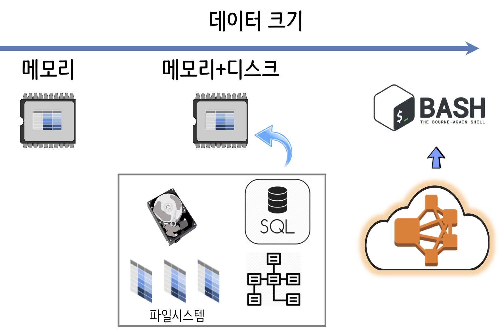
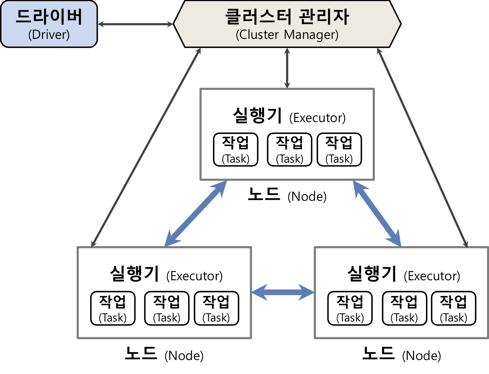
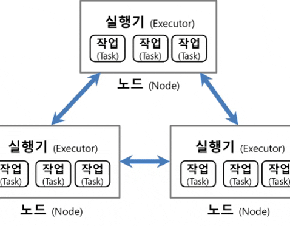

``` {r, include=FALSE}
# source("tools/chunk-options.R")
knitr::opts_chunk$set(echo = TRUE, warning=FALSE, message=FALSE,
                    comment="", digits = 3, tidy = FALSE, prompt = FALSE, fig.align = 'center')
library(reticulate)
use_condaenv("anaconda3")
# reticulate::repl_python()
```

# 빅데이터 처리 아키텍처 {#bigdata-architecture}

데이터가 메모리에 들어가게 되면 이는 작은 데이터(small data)로 바로 처리할 수 있는 반면, 데이터가 메모리에 들어가기 힘든 경우 파일시스템을 활용하거나, 데이터베이스를 사용한다.
데이터가 그럼에도 불구하고 크기가 큰 경우 데이터를 다수 컴퓨터로 구성된 클러스터(cluster)에 넣어 이를 처리한다.

{#id .class width="57%"}

빅데이터를 처리하기 위해서 스파크를 사용해서 클러스터를 구성해야 한다. 먼저 빅데이터 작업을 쪼개서 처리할 수 있도록 다수 노드(Node)로 구성된 클러스터를 구성한다. 다수 일감을 처리하도록 클러스터 관리자(cluster manager)를 통해 일감을 적절히 분배하여 처리하도록 구성한다. 그리고 나서 드라이버(drvier)를 통해 클러스터 관리자를 통제한다.

<div class = "row">
  <div class = "col-md-8">
**클러스터 구성 아키텍처**



  </div>
  <div class = "col-md-4">
**클러스터 구성 애니메이션**



  </div>
</div>

# 파이스파크 기본지식 {#pyspark-basic-knowledge}

스파크(Spark)에 접속해서 빅데이터를 다루는데 크게 네가지 언어가 많이 사용된다.

- 자바
- 스칼라
- R
- 파이썬

자바는 일단 REPL 지원에서 기능이 떨어져 제외하고 스칼라/파이썬/R을 고수준(High-level) 언어로 추천한다. `pyspark` 기준으로 보면 각 기능별로 다음 모듈이 필요하다.

- `pyspark.sql`: 정형 데이터
- `pyspark.streaming`: 시계열 스트리밍(streaming) 데이터
- `pyspark.ml` 혹은 `pyspark.mllib`: 기계학습

# `pyspark` 환경설정 {#pyspark-setup}


```{python pyspark-setup}
import pyspark

```

