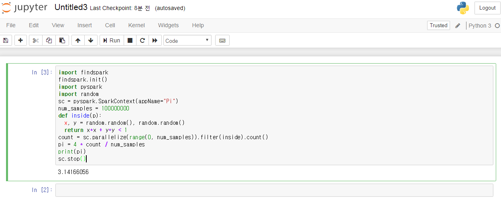

``` {r, include=FALSE}
# source("tools/chunk-options.R")
knitr::opts_chunk$set(echo = TRUE, warning=FALSE, message=FALSE,
                    comment="", digits = 3, tidy = FALSE, prompt = FALSE, fig.align = 'center')
```


# `pyspark` IDE [^pyspark-jupyter] {#spark-pyspark-ide}

[^pyspark-jupyter]: [Charles Bochet (May 2, 2017), "Get Started with PySpark and Jupyter Notebook in 3 Minutes"](https://blog.sicara.com/get-started-pyspark-jupyter-guide-tutorial-ae2fe84f594f)

자바 &rarr; 하둡 &rarr; 스파크를 설치한 후에 `pyspark`를 통해 작업을 수행하는 방식이 스칼라 언어가 아닌 경우 많이 사용되고 있다.
이를 위해서 쥬피터 노트북 같은 IDE가 필요한데 스파크에 `pyspark`을 통해 쥬피터 노트북으로 작업하는 방식을 살펴보자.


스파크에 `pyspark`로 접속하여 분석과 개발작업을 수행하는 방법은 쥬피터 노트북을 사용할 경우 두가지 방식이 존재한다.

## PySpark 드라이버 활용 {#spark-pyspark-ide-env}

`~/.bashrc` 파일에 환경설정 정보 반영하여 `pyspark` 명령어를 실행시키면 웹브라우저에 쥬피터 노트북이 떠 바로 작업하는 방법이 있다.

``` {r pyspark-bashrc, eval=FALSE}
# ~/.bashrc 파일 추가 내용
export PYSPARK_DRIVER_PYTHON=jupyter
export PYSPARK_DRIVER_PYTHON_OPTS='notebook'
```

## `findspark` 팩키지 사용 {#spark-pyspark-ide-jupyter}

`pip install findspark` 명령어로 `findspark`를 설치한다. `jupyter notebook` 명령어 혹은 Anaconda Navigator에서 쥬피터 노트북을 실행한 후에 `import findspark` 명령어로 
팩키지를 활용하는 방식이다. 즉, 쥬피터 노트북을 실행시키고 `import`로 불러와서 처리하는 방법이다.

``` {r findspark-jupyter-notebook, eval=FALSE}
import findspark
findspark.init()
import pyspark
import random
sc = pyspark.SparkContext(appName="Pi")
num_samples = 100000
def inside(p):     
  x, y = random.random(), random.random()
  return x*x + y*y < 1
count = sc.parallelize(range(0, num_samples)).filter(inside).count()
pi = 4 * count / num_samples
print(pi)
sc.stop()
```




# 노트북 운영문제 [^notebook-error] {#jupyter-notebook-trouble-shooting}

[^notebook-error]: [Error loading server extension jupyter_nbextensions_configurator #2584](https://github.com/jupyter/notebook/issues/2584)

`jupyter notebook`을 실행한 후에 `...NotebookApp] Error loading server extension jupyterlab` 문제가 발생될 경우 다음 명령어를 실행하면 오류를 잡을 수 있다.

```{r jupyter-notebook-extension, eval=FALSE}
> jupyter serverextension disable --sys-prefix jupyter_nbextensions_configurator
```


<style>
div.blue { background-color:#e6f0ff; border-radius: 5px; padding: 10px;}
</style>
<div class = "blue">

쥬피터 노트북에 (재)연결관련하여 문제가 발생할 경우 `cmd` 터미널에서 다음 명령어를 실행할 경우 도움이 될 수 있다.

`conda update jupyterlab` 

</div>


<style>
div.blue { background-color:#e6f0ff; border-radius: 5px; padding: 10px;}
</style>
<div class = "blue">

**쥬피터 노트북에 (재)연결관련하여 문제가 발생할 경우(Jupyter notebook keeps reconnecting to kernel)** [^stackoverflow-reconnect]

[^stackoverflow-reconnect]: [Jupyter notebook keeps reconnecting to kernel](https://stackoverflow.com/questions/42350182/jupyter-notebook-keeps-reconnecting-to-kernel)

포트(port)가 충돌나서 생기는 문제이기 때문에 이를 해결하는 방식은 다음과 같다.

1. `C:\Users\<사용자명>\.jupyter` 디렉토리로 이동한다.
1. `jupyter_notebook_config.py` 파일을 연다.
1. `c.NotebookApp.port` 행을 찾아 적당한 포트번호로 바꾼다.
    - 예를 들어: `8888` &rarr; `9875`


</div>


