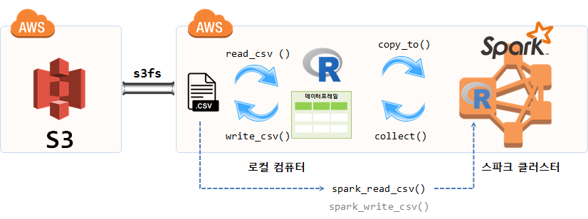
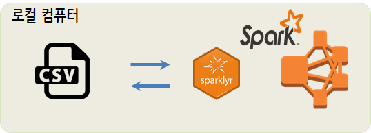

``` {r, include=FALSE}
# source("tools/chunk-options.R")
knitr::opts_chunk$set(echo = TRUE, warning=FALSE, message=FALSE,
                    comment="", digits = 3, tidy = FALSE, prompt = FALSE, fig.align = 'center')
```


# `.csv` 파일 &rarr; 로컬 스파크 {#aws-local-csv-sparklyr}

AWS S3 저장소에 데이터를 저장해서 활용하고, 스파크 클러스터를 별도 EC2 인스턴스로 묶어 
데이터를 분석하는 것이 많이 활용되는 패턴 중 하다.
특히 S3를 `s3fs`로 EC2와 동기화(sync)한 경우 마치 로컬 파일처럼 접근해서 데이터를 분석하는 것도 가능하다.



그전에 로컬 컴퓨터에 저장된 `.csv` 파일을 스파크 로컬 클러스터로 불러와서 데이터 분석작업을 수행하는 가장 간단한 사례를 상정해보자.




# 로컬 스파크 클러스터 생성 {#aws-local-csv-sparklyr-launch}

로컬 컴퓨터에 저장된 `.csv` 파일을 스파크 클러스터로 가져와서 분석을 진행하고자 할 때 
먼저 로컬 컴퓨터 `.csv` 파일을 준비하고 스파크 클러스터를 로컬에 생성시킨다.

``` {r read-csv-with-sparklyr-create}
# 1. 라이브러리
library(sparklyr)
library(tidyverse)

## 설치된 SPARK 버젼확인 설정
# Sys.getenv("SPARK_HOME")
# spark_home_dir()
# spark_installed_versions()

# 2. 스파크 클러스터 연결
sc <- spark_connect(master="local")

## 2.1. 스파크 버젼 확인
spark_version(sc=sc)
```

# `.csv` &rarr; 로컬 스파크 클러스터 불러오기 {#aws-local-csv-sparklyr-import}

스파크 클러스터가 별 문제 없이 생성된 경우 다음 작업으로 `sparklyr` 팩키지
`spark_read_csv()` 함수를 사용해서 데이터를 가져온다.

[캐글, "2015 Flight Delays and Cancellations - Which airline should you fly on to avoid significant delays?"](https://www.kaggle.com/usdot/flight-delays) 사이트에서 `flights.csv` 파일을 다운로드 받는다.
`flights.csv` 파일 크기는 579MB 정도 크기를 갖는다.

``` {r read-csv-with-sparklyr}
# 4. 로컬 CSV 파일 불러오기 -------------------------
flights <- spark_read_csv(sc, "flights_spark", 
                          path =  "data/flights.csv", 
                          memory = TRUE, 
                          infer_schema = TRUE)

flights
```


# 분석을 위한 기초작업 {#aws-local-csv-sparklyr-warmup}

분석에 필요한 필드를 추출해서 `sdf_register()` 함수로 스파크 데이터프레임으로 만든다.
`tbl_cache()` 함수로 캐쉬에 등록해서 빠른 데이터 분석 및 모형 개발이 되도록 조치를 취한다.

``` {r read-csv-with-sparklyr-warmup}
tidy_flights <- tbl(sc, "flights_spark") %>%
  mutate(ARRIVAL_DELAY   = as.integer(ARRIVAL_DELAY),
         DEPARTURE_DELAY = as.integer(DEPARTURE_DELAY),
         DISTANCE = as.integer(DISTANCE)) %>%
  filter(!is.na(ARRIVAL_DELAY)) %>%
  select(ARRIVAL_DELAY, DEPARTURE_DELAY, DISTANCE, AIRLINE ) %>%
  sdf_register("tidy_spark")

tbl_cache(sc, "tidy_spark")
```

# 탐색적 데이터 분석 {#aws-local-csv-sparklyr-EDA}

`tally` 함수를 통해서 전체 행수를 산출해 본다.
그리고 나서, `count()` 등을 통해서 본격적인 탐색적 데이터 분석작업에 들어간다.

``` {r read-csv-with-sparklyr-eda}
## 전체 행수
tbl(sc, "tidy_spark") %>% tally

## 항공사 빈도분석
tbl(sc, "tidy_spark") %>% count(AIRLINE, sort = TRUE)
```


# 회귀모형 {#aws-local-csv-sparklyr-model}

스파크에 내장된 기계학습 알고리즘을 통해서 예측 모형 구축 작업에 들어간다.


``` {r read-csv-with-sparklyr-model}
## 회귀분석
simple_model <- tidy_flights %>%
  ml_linear_regression(DEPARTURE_DELAY ~ ARRIVAL_DELAY + DISTANCE)

summary(simple_model)

## 스파크 클러스터 해제
spark_disconnect(sc)
```


