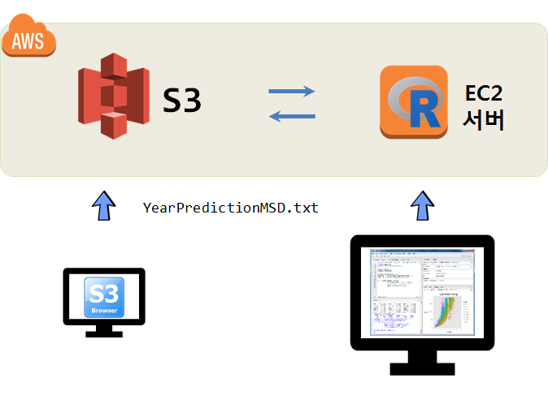
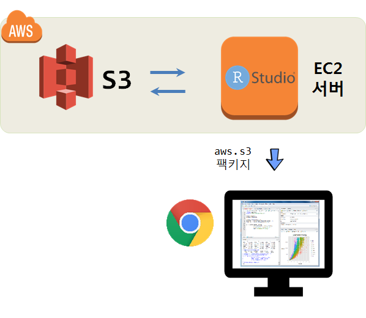
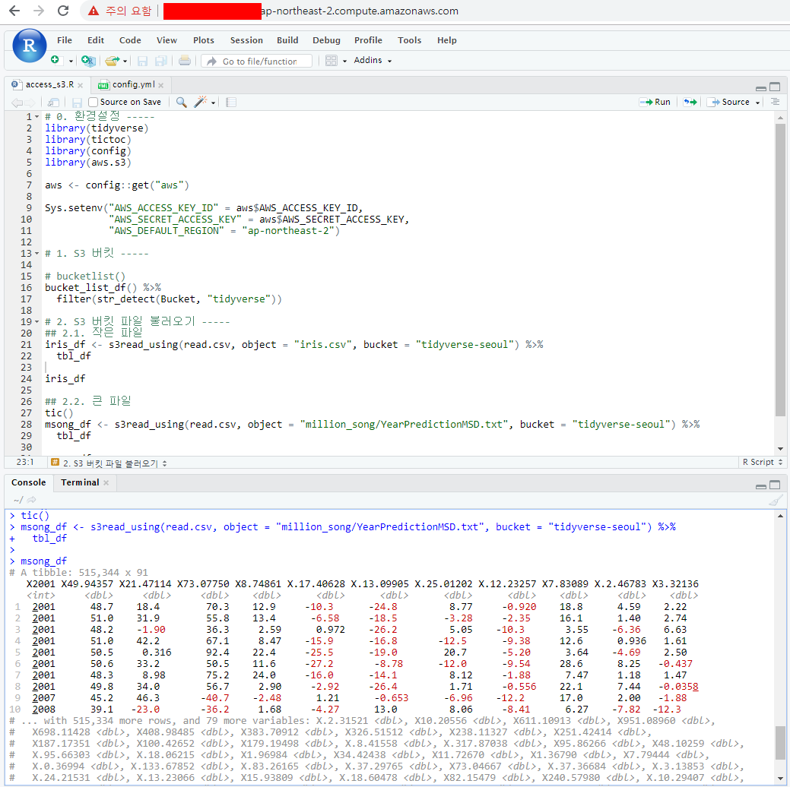

``` {r, include=FALSE}
# source("tools/chunk-options.R")
knitr::opts_chunk$set(echo = TRUE, warning=FALSE, message=FALSE,
                    comment="", digits = 3, tidy = FALSE, prompt = FALSE, fig.align = 'center')
```


# S3 백만송 데이터 &rarr; EC2 작업흐름 [^one-million-song-eda] [^music-recommendation] {#million-song-EDA}

[^one-million-song-eda]: [Jingying Zhou, Yibo Zhu, Yimin Zhang, Ziyue Jin, Ziyue Wu (April 27, 2016), "What is mainstream music? Million Songs Dataset Exploration"](https://zac2116.github.io/)
[^music-recommendation]: [databricks, "Predicting Song Listens Using Apache Spark"](https://databricks-prod-cloudfront.cloud.databricks.com/public/4027ec902e239c93eaaa8714f173bcfc/3175648861028866/48824497172554/657465297935335/latest.html)

빅데이터(백만송 데이터)를 분석하기 위해서 빅데이터는 클라우드 AWS S3에 저장하고, 이를 EC2에 설치한 스파크 클러스터를 통해 분석작업을 수행한다.
이를 위해서 다음과 같은 작업흐름을 갖출 수 있다.

1. S3 브라우저와 같은 FTP 프로그램을 이용하여 S3에 데이터를 전송한다.
    - [빅데이터 들어가며 - 기본기: AWS S3 파일 업로드](bigdata-pyspark-prerequisite.html#6_aws_s3_%ED%8C%8C%EC%9D%BC_%EC%97%85%EB%A1%9C%EB%93%9C) 참조
1. EC2 인스턴스에 우선 로컬 스파크 클러스터를 구축한다.
1. 로컬 PC에서 EC2 인스턴스에 RStudio 서버 IDE 로 접속하여 분석작업을 수행한다.



## 한걸음 더 들어갑니다. {#million-song-EDA-one-step-forward}

한걸음 더 들어가 S3 버킷에 데이터가 저장되어 있는 상태에서 데이터 분석에 필요한 연산작업을 
EC2 인스턴스를 생성시켜 이를 통해서 추진하는 것이다.
EC2 인스턴스에 명령을 내리기 위해서 외부 로컬 컴퓨터에서 웹브라우저를 통해 접속하게 된다.




# EC2에서 S3 접근 [^aws.s3-read-file] {#million-song-s3-access}

[^aws.s3-read-file]: [Reading a csv file from S3:// in R #201](https://github.com/cloudyr/aws.s3/issues/201)

EC2에서 S3로 접근하려면 `aws.s3` 팩키지를 사용한다. S3에 접근하기 위해서 `AWS_ACCESS_KEY_ID`, 
`AWS_SECRET_ACCESS_KEY`, `AWS_DEFAULT_REGION`을 설정한다. 
설정된 내용이 제대로 되었는지는 `bucketlist()` 함수로 확인되면,
`s3read_using()` 함수를 사용해서 CSV 파일을 EC2 컴퓨터에 데이터프레임으로 가져온다.

[S3 &rarr; 로컬 RStudio IDE](bigdata-sparklyr-read-data-s3-local.html#2_aws_s3_저장소_인증) AWS S3 저장소 인증를 참조하여 
동일하게 `AWS_ACCESS_KEY_ID`, `AWS_SECRET_ACCESS_KEY`, `AWS_DEFAULT_REGION`을 설정하여 `config.yml` 파일에 담아둔다.
인증키를 활용하여 작은 데이터 `iris.csv` 파일 뿐만 아니라 `YearPredictionMSD.txt` 파일도 불러온다.

`tictoc()` 팩키지를 설치하여 불러오는데 소요된 시간도 확인한다. `YearPredictionMSD.txt` 파일크기는 약 500MB 정도 크기를 갖는다.

``` {r access-to-S3-from-ec2, eval=FALSE}
# 0. 환경설정 -----
library(tidyverse)
library(tictoc)
library(config)
library(aws.s3)

aws <- config::get("aws")

Sys.setenv("AWS_ACCESS_KEY_ID" = aws$AWS_ACCESS_KEY_ID,
           "AWS_SECRET_ACCESS_KEY" = aws$AWS_SECRET_ACCESS_KEY,
           "AWS_DEFAULT_REGION" = "ap-northeast-2")

# 1. S3 버킷 -----

# bucketlist()
bucket_list_df() %>% 
  filter(str_detect(Bucket, "tidyverse"))

# 2. S3 버킷 파일 불러오기 -----
## 2.1. 작은 파일 
iris_df <- s3read_using(read.csv, object = "iris.csv", bucket = "tidyverse-seoul") %>% 
  tbl_df

iris_df

## 2.2. 큰 파일 
tic()
msong_df <- s3read_using(read.csv, object = "million_song/YearPredictionMSD.txt", bucket = "tidyverse-seoul") %>% 
  tbl_df

msong_df
toc()
225.706 sec elapsed
```




