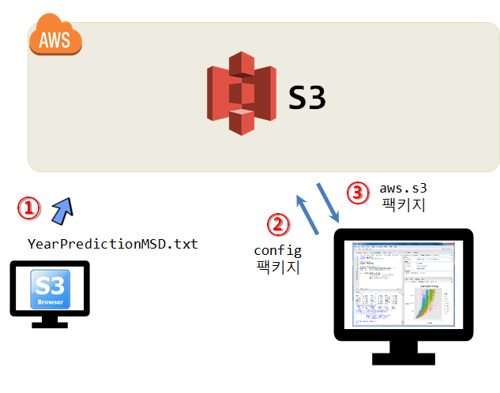

``` {r, include=FALSE}
# source("tools/chunk-options.R")
knitr::opts_chunk$set(echo = TRUE, warning=FALSE, message=FALSE,
                    comment="", digits = 3, tidy = FALSE, prompt = FALSE, fig.align = 'center')
```


# S3 백만송 데이터 &rarr; 로컬 컴퓨터 [^one-million-song-eda] [^music-recommendation] {#million-song-EDA}

[^one-million-song-eda]: [Jingying Zhou, Yibo Zhu, Yimin Zhang, Ziyue Jin, Ziyue Wu (April 27, 2016), "What is mainstream music? Million Songs Dataset Exploration"](https://zac2116.github.io/)
[^music-recommendation]: [databricks, "Predicting Song Listens Using Apache Spark"](https://databricks-prod-cloudfront.cloud.databricks.com/public/4027ec902e239c93eaaa8714f173bcfc/3175648861028866/48824497172554/657465297935335/latest.html)

빅데이터(백만송 데이터)를 분석하기 위해서 빅데이터는 클라우드 AWS S3에 저장하고, 이를 EC2에 설치한 스파크 클러스터를 통해 분석작업을 수행한다.
이를 위해서 다음과 같은 작업흐름을 갖출 수 있다.

1. S3 브라우저와 같은 FTP 프로그램을 이용하여 S3에 데이터를 전송한다.
    - [빅데이터 들어가며 - 기본기: AWS S3 파일 업로드](bigdata-pyspark-prerequisite.html#6_aws_s3_%ED%8C%8C%EC%9D%BC_%EC%97%85%EB%A1%9C%EB%93%9C) 참조
1. `config` 팩키지를 통해 인증작업을 수행한다.
1. 로컬 PC에서 S3 저장소에 접속하여 분석작업을 수행한다.



# AWS S3 저장소 인증 {#aws-s3-config}

AWS S3 저장소에 `config` 팩키지를 활용하여 인증설정을 한다.
`install.packages("config")` 명령어로 `config` 팩키지를 설치하게 되면 `config.yml` 파일 내부에 환경설정에 필요한 정보를 담을 수가 있다.

`config.xml`파일을 만들어 `AWS_ACCESS_KEY_ID`, `AWS_SECRET_ACCESS_KEY`를 지정한다. `.gitignore`에 `config.xml`파일을 등록시켜 GitHub 등 외부에 누출되지 않도록 특히 유의한다.

```{r s3-config-login-setup, eval=FALSE}
## config.xml
default:
  aws:
    AWS_ACCESS_KEY_ID: 'xxxxxxxxxxxxxE65Q'
    AWS_SECRET_ACCESS_KEY: 'xxxxxxxxxxxxxxxxxxxxxxxxxxmBeV0'
    AWS_DEFAULT_REGION: 'ap-northeast-2'
```


```{r s3-config-login}
library(tidyverse)
library(config)

aws <- config::get("aws")
```

`bucketlist()` 함수를 통해서 앞서 S3 접근 인증된 버킷에 접근할 수 있다.
특히, `bucket_list_df()` 함수는 데이터프레임으로 버킷 데이터를 변경시켜주기 때문에 `dplyr` 동사를 사용해서 다양한 후속 작업도 가능하다.

```{r s3-config-login-s3}
# devtools::install_github("cloudyr/aws.s3")
library(aws.s3)

# bucketlist()
bucket_list_df() %>% 
  filter(str_detect(Bucket, "tidyverse"))
```

# AWS S3 버킷 데이터 가져오기 [^aws-s3-kr-blog] [^aws-s3-athena] {#aws-s3-config-import}

[^aws-s3-kr-blog]: [AWS - R에서 S3의 데이터 가져오기](https://hjpco.wordpress.com/2017/06/17/aws-r%EC%97%90%EC%84%9C-s3%EC%9D%98-%EB%8D%B0%EC%9D%B4%ED%84%B0-%EA%B0%80%EC%A0%B8%EC%98%A4%EA%B8%B0/)

[^aws-s3-athena]: [Gopal Wunnava (17 MAR 2017), "Running R on Amazon Athena"](https://aws.amazon.com/ko/blogs/big-data/running-r-on-amazon-athena/)

```{r aws-config-get}
Sys.setenv("AWS_ACCESS_KEY_ID" = aws$AWS_ACCESS_KEY_ID,
           "AWS_SECRET_ACCESS_KEY" = aws$AWS_SECRET_ACCESS_KEY,
           "AWS_DEFAULT_REGION" = "ap-northeast-2")

iris_df <- s3read_using(read.csv, object = "iris.csv", bucket = "tidyverse-seoul") %>% 
  tbl_df

iris_df
```

`iris.csv` 대신에 `YearPredictionMSD.txt` 약 500MB 데이터를 불러와 보자.

```{r aws-config-get-million-song}
msong_df <- s3read_using(read.csv, object = "million_song/YearPredictionMSD.txt", bucket = "tidyverse-seoul") %>% 
  tbl_df

msong_df
```
