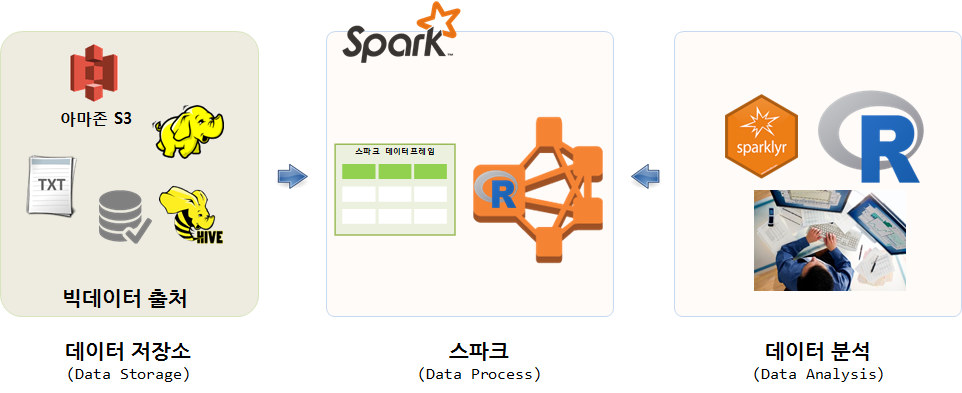
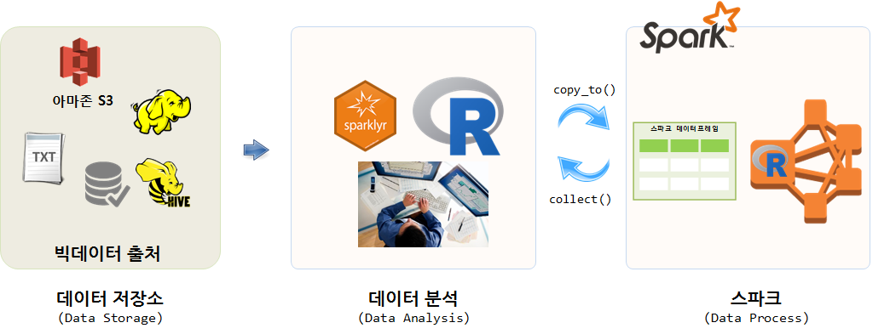
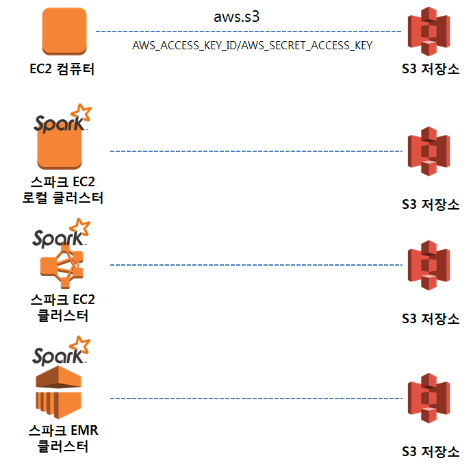

``` {r, include=FALSE}
# source("tools/chunk-options.R")
knitr::opts_chunk$set(echo = TRUE, warning=FALSE, message=FALSE,
                    comment="", digits = 3, tidy = FALSE, prompt = FALSE, fig.align = 'center')
```


# S3 데이터를 적재하는 두가지 방법 [^load-data-on-spark] {#load-data-on-spark}

[^load-data-on-spark]: [RStudio Webinar - Understanding sparklyr deployment modes](https://www.rstudio.com/resources/webinars/understanding-sparklyr-deployment-modes/)

가장 이상적으로 AWS S3, 하둡, RDBMS 등 데이터를 스파크 클러스터를 통해 가져오는 것이 이상적인 방법이다.
즉, `sparkly` 팩키지를 활용하여 스파크 클러스터가 원천 데이터의 위치를 파악하고 이를 매핑하여 불러와서 분석작업을 수행시키는 방법으로,
대용량 데이터 분석에 적합하지만, 모든 노드가 URL, 네트워크 경로 등을 맞춰야 하는 수고스러움도 있다.



또 다른 방법은 원천 데이터를 R로 불러읽어온다. 
그리고 나서 `copy_to()` 명령어를 활용하여 스파크에 데이터를 넘겨 빅데이터를 분석한다.
상대적으로 데이터 크기가 적은 경우 유용한 방법이 될 수 있다.




# AWS S3 데이터를 읽어오는 전략 {#load-data-on-spark-strategy}

AWS S3에 저장된 대용량 데이터를 읽어오는 전략은 다음과 크게 4가지 방식이 존재한다.

- EC2 컴퓨터에서 직접 `aws.s3` 팩키지를 통해 직접 S3 저장소 접근
- 스파크 클러스터를 EC2 컴퓨터를 로컬 컴퓨터로 생성시켜 S3 저장소 접근 
- EC2 컴퓨터를 `flintrock` 유형의 도구를 활용하여 스파크 클러스터를 생성시켜 S3 저장소 접근 
- AWS EMR을 활용하여 단속으로 필요시 마다 스파크 클러스터를 생성시켜 S3 저장소 접근 

첫번째 방식은 많이 활용되는 방식으로 아래 매뉴얼을 활용하여 따라가면 문제가 없고, 
AWS EMR 방식도 AWS에서 EMR 스파크 클러스터를 생성시킬 때 설정을 잘 맞춰놔서 필요한 일부 설정만으로도 S3 저장소에 접근할 수 있다.
EC2에 스파크 클러스터를 직접 설치하는 경우 S3 저장소에 설정을 잘 맞춰놓는 것이 그렇게 쉽지만은 않다.




# 데이터 형식을 고려한 전략 {#pyspark-read-s3-data-csv}

S3 데이터는 `.csv`, `.xlsx` 등 친숙한 파일 형태로 있을 수 있지만, 빅데이터를 효과적으로 저장하기 위해서 `.parquet` 형태로 저장되어 있기도하다. 이를 불러들여 처리하기 위해서 두가지 조합이 필요하고 데이터 사이언스 언어(R/파이썬)에 따라 두가지 조합이 추가로 필요하다.

- S3 `.csv`: EC2 인스턴스 파이썬 판다스, **RStudio 서버**
- S3 `.parquet`: 스파크 클러스터 `pyspark`, **RStudio `sparklyr`**


- S3에 담긴 `.csv` 파일: ①
    - EC2 인스턴스 파이썬 판다스
    - **EC2 인스턴스 RStudio 서버로 가져오기**
- S3에 담긴 `.parquet` 파일: ②
    - EC2 인스턴스 파이썬 판다스
    - **EC2 인스턴스 RStudio 서버로 가져오기**
- S3에 담긴 `.csv` 파일: ③
    - EC2 스파크 클러스터 파이썬 - `pyspark`
    - **EC2 스파크 클러스터 RStudio - `sparklyr`**
- S3에 담긴 `.parquet` 파일: ④
    - EC2 스파크 클러스터 파이썬 - `pyspark`
    - **EC2 스파크 클러스터 RStudio - `sparklyr`**


