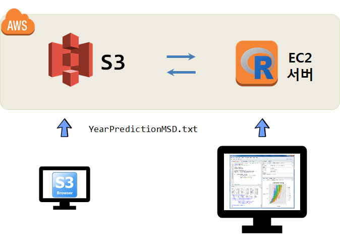

``` {r, include=FALSE}
# source("tools/chunk-options.R")
knitr::opts_chunk$set(echo = TRUE, warning=FALSE, message=FALSE,
                    comment="", digits = 3, tidy = FALSE, prompt = FALSE, fig.align = 'center')
```

# AWS S3 파일 업로드 {#million-song-s3-upload}

AWS에서 스파크 데이터 분석을 위해서 먼저 S3에 데이터를 준비해야 한다. 
로컬 컴퓨터에서 AWS S3로 데이터를 전송하는 방식은 AWS CLI (`aws-shell`)을 이용한 방법과 
GUI로 [S3 브라우져 프로그램](http://s3browser.com/)을 사용하는 방식이 존재한다.

## GUI - S3 브라우져 프로그램 {#million-song-s3-upload-gui}

로컬 컴퓨터에서 FTP 프로그램 중 AWS S3 데이터 송수신을 위해 개발된 [S3 브라우져 프로그램](http://s3browser.com/)을 사용해서 데이터를 올리는 방식은 다음과 같다.
S3 버킷에 파일을 올리기 위해서 다음 두가지 단계를 거쳐 작업을 진행한다.

1. `Accounts` &rarr; `Storage Accounts` &rarr; `Edit Account` 로 이동한다.
1. `Access Key ID`, `Secret Access Key` 를 설정한다.
1. 로컬 PC `YearPredictionMSD.txt` 파일을 S3 버킷으로 올린다.


## CLI - AWS CLI  {#million-song-s3-upload-cli}

[AWS CLI 헬로 월드](bigdata-pyspark-prerequisite.html#5_aws_cli_%ED%97%AC%EB%A1%9C_%EC%9B%94%EB%93%9C)를 참고한다.

# S3 버킷 데이터 읽어오기 {#pyspark-read-s3-data-csv}

S3 데이터는 `.csv`, `.xlsx` 등 친숙한 파일 형태로 있을 수 있지만, 빅데이터를 효과적으로 저장하기 위해서 `.parquet` 형태로 저장되어 있기도하다. 이를 불러들여 처리하기 위해서 두가지 조합이 필요하고 데이터 사이언스 언어(R/파이썬)에 따라 두가지 조합이 추가로 필요하다.

- S3 `.csv`: EC2 인스턴스 파이썬 판다스, **RStudio 서버**
- S3 `.parquet`: 스파크 클러스터 `pyspark`, **RStudio `sparklyr`**


- S3에 담긴 `.csv` 파일: ①
    - EC2 인스턴스 파이썬 판다스
    - **EC2 인스턴스 RStudio 서버로 가져오기**
- S3에 담긴 `.parquet` 파일: ②
    - EC2 인스턴스 파이썬 판다스
    - **EC2 인스턴스 RStudio 서버로 가져오기**
- S3에 담긴 `.csv` 파일: ③
    - EC2 스파크 클러스터 파이썬 - `pyspark`
    - **EC2 스파크 클러스터 RStudio - `sparklyr`**
- S3에 담긴 `.parquet` 파일: ④
    - EC2 스파크 클러스터 파이썬 - `pyspark`
    - **EC2 스파크 클러스터 RStudio - `sparklyr`**


# EC2 &rarr; S3 백만송 데이터 작업흐름 [^one-million-song-eda] [^music-recommendation] {#million-song-EDA}

[^one-million-song-eda]: [Jingying Zhou, Yibo Zhu, Yimin Zhang, Ziyue Jin, Ziyue Wu (April 27, 2016), "What is mainstream music? Million Songs Dataset Exploration"](https://zac2116.github.io/)
[^music-recommendation]: [databricks, "Predicting Song Listens Using Apache Spark"](https://databricks-prod-cloudfront.cloud.databricks.com/public/4027ec902e239c93eaaa8714f173bcfc/3175648861028866/48824497172554/657465297935335/latest.html)

빅데이터(백만송 데이터)를 분석하기 위해서 빅데이터는 클라우드 AWS S3에 저장하고, 이를 EC2에 설치한 스파크 클러스터를 통해 분석작업을 수행한다.
이를 위해서 다음과 같은 작업흐름을 갖출 수 있다.

1. S3 브라우저와 같은 FTP 프로그램을 이용하여 S3에 데이터를 전송한다.
1. EC2 인스턴스에 우선 로컬 스파크 클러스터를 구축한다.
1. 로컬 PC에서 EC2 인스턴스에 RStudio 서버 IDE 로 접속하여 분석작업을 수행한다.



## EC2에서 S3 접근 [^aws.s3-read-file] {#million-song-s3-access}

[^aws.s3-read-file]: [Reading a csv file from S3:// in R #201](https://github.com/cloudyr/aws.s3/issues/201)

EC2에서 S3로 접근하려면 `aws.s3` 팩키지를 사용한다. S3에 접근하기 위해서 `AWS_ACCESS_KEY_ID`, 
`AWS_SECRET_ACCESS_KEY`, `AWS_DEFAULT_REGION`을 설정한다. 
설정된 내용이 제대로 되었는지는 `bucketlist()` 함수로 확인되면,
`s3read_using()` 함수를 사용해서 CSV 파일을 EC2 컴퓨터에 데이터프레임으로 가져온다.

``` {r access-to-S3-from-ec2, eval=FALSE}
# 1. 환경설정 -----
# install.packages("devtools")
# devtools::install_github("cloudyr/aws.s3")

library(aws.s3)
library(tidyverse)

# 2. S3 버킷 접근을 위한 키값 설정
Sys.setenv("AWS_ACCESS_KEY_ID" = "A************************",
           "AWS_SECRET_ACCESS_KEY" = "V*************************",
           "AWS_DEFAULT_REGION" = "ap-northeast-2")

# 3. S3 버킷 헬로월드
## 3.1. 버킷 확인
bucketlist()

## 3.2. 데이터 가져오기
msong_df <- s3read_using(read_csv, object = "s3://<버킷명>/million_song/YearPredictionMSD.txt", col_names = FALSE)

## 3.3. 데이터 확인
msong_df

# A tibble: 515,345 x 91
      X1    X2      X3    X4     X5      X6      X7     X8      X9   X10    X11     X12    X13   X14   X15   X16   X17   X18
   <int> <dbl>   <dbl> <dbl>  <dbl>   <dbl>   <dbl>  <dbl>   <dbl> <dbl>  <dbl>   <dbl>  <dbl> <dbl> <dbl> <dbl> <dbl> <dbl>
 1  2001  49.9  21.5    73.1   8.75 -17.4   -13.1   -25.0  -12.2    7.83 -2.47   3.32   -2.32  10.2   611.  951.  698.  409.
 2  2001  48.7  18.4    70.3  12.9  -10.3   -24.8     8.77  -0.920 18.8   4.59   2.22    0.340 44.4  2057.  605.  457.  777.
 3  2001  51.0  31.9    55.8  13.4   -6.58  -18.5    -3.28  -2.35  16.1   1.40   2.74    0.828  7.47  700. 1016.  594.  356.
 4  2001  48.2  -1.90   36.3   2.59   0.972 -26.2     5.05 -10.3    3.55 -6.36   6.63   -3.35  37.6  2174.  697.  459.  743.
 5  2001  51.0  42.2    67.1   8.47 -15.9   -16.8   -12.5   -9.38  12.6   0.936  1.61    2.19  47.3   894.  810.  319.  435.
 6  2001  50.5   0.316  92.4  22.4  -25.5   -19.0    20.7   -5.20   3.64 -4.69   2.50   -3.02   7.69 1005.  785.  592.  496.
 7  2001  50.6  33.2    50.5  11.6  -27.2    -8.78  -12.0   -9.54  28.6   8.25  -0.437   5.66  11.1  1081. 1231. 1302.  953.
 8  2001  48.3   8.98   75.2  24.0  -16.0   -14.1     8.12  -1.88   7.47  1.18   1.47   -6.34   8.40 1620. 1762.  715. 1116.
 9  2001  49.8  34.0    56.7   2.90  -2.92  -26.4     1.71  -0.556 22.1   7.44  -0.0358  1.67  46.0   790.  608.  249.  288.
10  2007  45.2  46.3   -40.7  -2.48   1.21   -0.653  -6.96 -12.2   17.0   2.00  -1.88    9.85  25.6  1905. 3676. 1977.  913.
# ... with 515,335 more rows, and 73 more variables: X19 <dbl>, X20 <dbl>, X21 <dbl>, X22 <dbl>, X23 <dbl>, X24 <dbl>,
#   X25 <dbl>, X26 <dbl>, X27 <dbl>, X28 <dbl>, X29 <dbl>, X30 <dbl>, X31 <dbl>, X32 <dbl>, X33 <dbl>, X34 <dbl>, X35 <dbl>,
#   X36 <dbl>, X37 <dbl>, X38 <dbl>, X39 <dbl>, X40 <dbl>, X41 <dbl>, X42 <dbl>, X43 <dbl>, X44 <dbl>, X45 <dbl>, X46 <dbl>,
#   X47 <dbl>, X48 <dbl>, X49 <dbl>, X50 <dbl>, X51 <dbl>, X52 <dbl>, X53 <dbl>, X54 <dbl>, X55 <dbl>, X56 <dbl>, X57 <dbl>,
#   X58 <dbl>, X59 <dbl>, X60 <dbl>, X61 <dbl>, X62 <dbl>, X63 <dbl>, X64 <dbl>, X65 <dbl>, X66 <dbl>, X67 <dbl>, X68 <dbl>,
#   X69 <dbl>, X70 <dbl>, X71 <dbl>, X72 <dbl>, X73 <dbl>, X74 <dbl>, X75 <dbl>, X76 <dbl>, X77 <dbl>, X78 <dbl>, X79 <dbl>,
#   X80 <dbl>, X81 <dbl>, X82 <dbl>, X83 <dbl>, X84 <dbl>, X85 <dbl>, X86 <dbl>, X87 <dbl>, X88 <dbl>, X89 <dbl>, X90 <dbl>,
#   X91 <dbl>
```

# EC2 스파크 &rarr; S3 백만송 데이터 작업흐름 [^one-million-song-eda] [^music-recommendation] {#million-song-EDA}

## 스파크 EC2 설치 {#million-song-spark-install-ec2}

자바는 설치해야 되고, `sudo apt-get install openjdk-8-jdk` 명령어를 통해서 간단히 설치할 수 있다.
그리고 나서 `sparklyr` 팩키지를 설치하고 `spark_install(version = "2.3.2")` 명령어로 스파크를 설치하여 `R`과 연결까지 쉽게 할 수 있다.
RStudio 엔지너어들이 수년동안 노력하면서 버그를 잡아낸 결과 단 한줄의 명령어로 문제를 쉽게 해소할 수 있게 되었다.
`spark_connect()` 함수로 스파크에 연결점을 생성하고 `iris` 데이터프레임을 `copy_to()` 명령어로 던져넣게 되면 
스파크에 `iris` RDD 데이터를 분석할 수 있게 된다. `src_tbls(sc)` 명령어로 분석가능한 RDD가 무엇인지 확인할 수 있고 
`dplyr` 동사로 스파크 클러스터에 올라온 데이터를 분석할 수 있게 되었다.


```{r aws-ec2-spark-install, eval=FALSE}
# 1. 환경설정 -----
# install.packages("devtools")
# devtools::install_github("cloudyr/aws.s3")

library(aws.s3)
library(tidyverse)
library(sparklyr)

# 2. 스파크 설치 -----
spark_install(version = "2.3.2")

# 3. 스파크 연결 -----
sc <- spark_connect(master = "local")

spark_home_dir()

# 4. 데이터 분석작업 -----
iris_tbl <- copy_to(sc, iris)
src_tbls(sc)
[1] "iris"
iris_tbl %>% 
   sample_n(5)
# Source: spark<?> [?? x 5]
  Sepal_Length Sepal_Width Petal_Length Petal_Width Species
*        <dbl>       <dbl>        <dbl>       <dbl> <chr>  
1          5.1         3.5          1.4         0.2 setosa 
2          4.9         3            1.4         0.2 setosa 
3          4.7         3.2          1.3         0.2 setosa 
4          4.6         3.1          1.5         0.2 setosa 
5          5           3.6          1.4         0.2 setosa 
```


