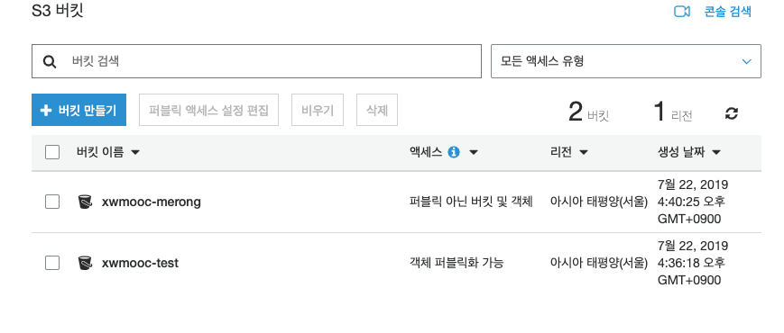

``` {r, include=FALSE}
# source("tools/chunk-options.R")
knitr::opts_chunk$set(echo = TRUE, warning=FALSE, message=FALSE,
                    comment="", digits = 3, tidy = FALSE, prompt = FALSE, fig.align = 'center')
library(reticulate)
use_condaenv("anaconda3")
# reticulate::repl_python()
```

# AWS 도구 {#aws-tools}

## AWS 명령줄 인터페이스(CLI) {#aws-cli}

[AWS 명령줄 인터페이스(CLI)](https://aws.amazon.com/ko/cli/)는 AWS 서비스를 관리하는 통합 도구로 AWS를 GUI대신 CLI를 사용해서 클라우드를 활용할 수 있도록 도와주는 유용한 도구다.

`pip install awscli` 명령어를 사용해서 맥이나 리눅스에서 설치가 가능하다. `Cannot uninstall 'PyYAML'` 오류가 나는 경우 `brew reinstall awscli` 명령어를 사용해서 설치한다.
결과는 사용자 홈디렉토리(`~`)에 `.aws` 디렉토리가 생성된다. `configure` 파일에 프로파일을 생성시키고 다양한 사용자를 만들어서 리소스(자원)에 접근하는 내용을 명세한다.

```{r aws-cli, eval=FALSE}
$ pip install awscli
$ brew reinstall awscli
$ tree ~/.aws
/Users/statkclee/.aws
├── config
└── credentials
```

## AWS 사용자 생성 {#aws-iam}

AWS IAM 서비스에서 사용자를 생성시킨다. 먼저 `victor_s3` 사용자 계정으로 `AmazonS3FullAccess` 권한을 갖도록 설정한다. `S3` 버킷을 `xwmooc-test` 이름으로 생성한 경우 `aws s3 ls --profile victor_s3` 명령어를 통해서 `.aws/config`에 설정한 [victor_s3] 프로파일을 통해서 S3에 대한 모든 설정이 가능하게 된다.

<div class = "row">
  <div class = "col-md-6">
**S3 버킷 GUI**



  </div>
  <div class = "col-md-6">
**S3 버킷 CLI**

```{bash aws-iam}
aws s3 ls --profile victor_s3
```

  </div>
</div>

## BOTO3 {#aws-cli-boto3}

Python용 AWS SDK인 [`boto3`](https://aws.amazon.com/ko/sdk-for-python/)를 사용하여 AWS를 풍부하게 사용할 수 있다. 설치 명령어는 `pip install boto3` 이다.

```{r pip-boto3, eval=FALSE}
$ pip install boto3
```


파이썬으로 Boto3 헬로월드를 찍어보자. 프로파일(profile) 없이 사용할 경우 `aws_access_key_id`,  `aws_secret_access_key` 가 노출 될 가능성이 크기 때문에 `.aws/config` 파일의 프로파일을 불러서 사용하도록 하고 이를 활용한다.

```{python boto3-hello-world}
import boto3

session = boto3.Session(profile_name='victor_s3')
s3_client = session.client('s3')

# Print out bucket names
response = s3_client.list_buckets()

[bucket['Name'] for bucket in response['Buckets']]
```


