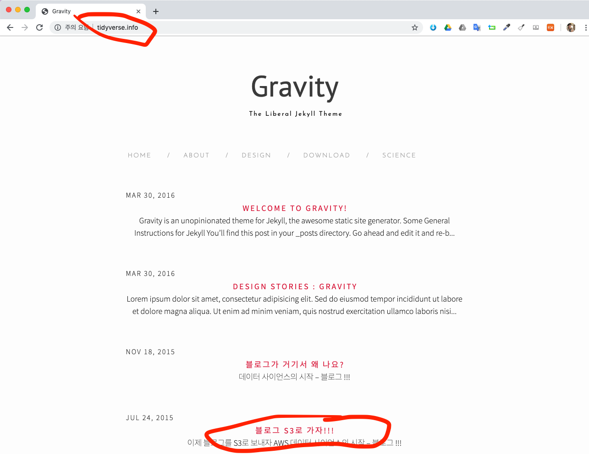

``` {r, include=FALSE}
# source("tools/chunk-options.R")
knitr::opts_chunk$set(echo = TRUE, warning=FALSE, message=FALSE,
                    comment="", digits = 3, tidy = FALSE, prompt = FALSE, fig.align = 'center')
library(reticulate)
use_condaenv("anaconda3")
# reticulate::repl_python()
```

# AWS 도메인 구입 [^s3-route53] {#aws-domain-purchase}

[^s3-route53]: [pyrasis.com, "Route 53와 S3 연동하기"](http://pyrasis.com/book/TheArtOfAmazonWebServices/Chapter17/03)

`github.io`, `netlify.com`, `s3-website.ap-northeast-2.amazonaws.com` 등등 공개된 무료 정적 웹 호스팅 서비스는 많다. 하지만, 개인 아이디가 노출되고 추구하는 바를 URL에 담아내는데 한계가 있다. 이를 극복하는 방법은 년 만원정도 비용을 지불하고 도메인을 구입하고 이를 블로그에 연계시키는 것이 한 방법이 될 수 있다.

도메인 구입 방법은 여러가지가 있지만, 아무래도 새로 도메인을 구입하여 운영하고자 하는 경우 규모가 있는 AWS, Azure, GCP 등 클라우드 서비스에서 자체적으로 도메인을 구입하는 것이 여러모로 편리할 수 있다. 년간 몇천원 절약하기 위해서 시간을 이리저리 사용하는 것보다 클라우스 서비스 제공업체에서 도메인을 구입하는 방법이 훌륭한 대안으로 부상하고 있다.

<style>
div.blue { background-color:#e6f0ff; border-radius: 5px; padding: 10px;}
</style>
<div class = "blue">

- [30.[AWS] AWS에서 도메인 구매하기](https://brunch.co.kr/@topasvga/292)

</div>

<https://console.aws.amazon.com/route53/home?region=ap-northeast-2#> AWS Route 53 **도메인 등록** 웹사이트에서 도메인을 구입하고 **DNS관리** 에서 "네임서버 관리" 기능을 활용하여 구입한 도메인을 S3 정적 웹 호스팅 서비스와 연결시킨다.


# Jekyll 웹사이트 &rarr; S3 [^jekyll-aws-s3] {#aws-jekyll-S3}

[^jekyll-aws-s3]: [Adrian Teng-Amnuay Fail (10 May 2018), "Hosting a static Jekyll website on Amazon S3"](https://adrian.tengamnuay.me/programming/2018/05/10/hosting-jekyll-site-on-s3/)

[빅데이터: 정적 웹호스팅 - S3](https://statkclee.github.io/bigdata/cloud-aws-s3-web-hosting.html) 내용을 참고하면 AWS S3에 Jekyll 웹사이트를 올릴 수가 있다. 단, GUI를 사용해서 자동화에 한계가 있다.
[데이터 사이언스: 저작(Authoring) "Github - 블로그"](https://statkclee.github.io/ds-authoring/ds-github-blog.html)을 참조하면 GitHub에도 블로그용 정적 웹사이트를 쉽게 만들어 올릴 수가 있다.

`aws cli`를 사용해서 GUI 대신 코드를 작성해서 구매한 도메인을 연결시킬 수 있다.

## S3 버킷 생성 {#S3-bucket-domain}

`tidyverse.info` 도메인을 $12 달러에 구매하게 되면 세금이 붙어 $13.2 달러가 청구된다 동일한 명칭을 갖는 S3 버킷을 `aws s3 mb` 명령어로 생성시킨다.

```{r create-s3-bucket, eval=FALSE}
$ aws s3 mb s3://tidyverse.info
```

## 블로그 콘텐츠 업로드 {#S3-bucket-domain-upload}

다음으로 생성한 S3 `tidyverse.info` 버킷에 블로그 콘텐츠를 쭉 업로드 시킨다.
`--profile victor_s3` 프로파일을 사용해서 제킬로 생성된 `_site` 모든 객체를 S3 `tidyverse.info` 버킷 쭉 밀어 넣는다.

```{r create-s3-bucket-jekyll, eval=FALSE}
$ aws --profile victor_s3 s3 sync _site s3://tidyverse.info
```

## 블로그 추가 콘텐츠 업로드 {#S3-bucket-domain-upload-again}

블로그를 추가로 생성하게 되면 이를 다시 AWS S3 버킷에 밀어올려야 하는데, 이런 경우 `jekyll build` 명령어를 실행시키면 `_posts/` 에 추가된 마크다운 파일을 `_site` 디렉토리에 컴파일해서 새로운 정적 웹 사이트를 만들어 낸다. 이를 [블로그 콘텐츠 업로드](#S3-bucket-domain-upload)를 참조하여 다시 업로드 시키면 된다. 

```{r create-s3-bucket-build, eval=FALSE}
$ jekyll build
$ aws --profile victor_s3 s3 sync _site s3://tidyverse.info
```


## 버킷 정적 웹사이트 호스팅 CLI {#S3-bucket-domain-static}

S3 버킷이 정적 웹사이트 호스팅 설정이 되어 있지 않기 때문에 이를 정적 웹사이트 호스팅이 되도록 환경설정을 바꾼다. `aws s3 website` 명령어가 버킷을 정적 웹사이트 호스팅 기능으로 바꿔주는 역할을 한다.

```{r create-s3-bucket-webhosting, eval=FALSE}
$ aws s3 website s3://tidyverse.info --index-document index.html --error-document 404.html
```

## 버킷 정적 웹사이트 호스팅 권한 {#S3-bucket-domain-static-permision}

버킷 권한 정책을 바꿔줘야 하는데 이를 위해서 준비한 스크립트를 활용한다.

```{r create-s3-bucket-webhosting-policy, eval=FALSE}
$ aws s3api put-bucket-policy \
  --bucket tidyverse.info \
  --policy \
'{
  "Version":"2012-10-17",
  "Statement":[{
        "Sid":"PublicReadGetObject",
        "Effect":"Allow",
          "Principal": "*",
      "Action":["s3:GetObject"],
      "Resource":["arn:aws:s3:::tidyverse.info/*"]
    }
  ]
}'
```

# S3와 Route 53 연동 {#s3-route53}

S3의 정적 웹사이트 호스팅 기능을 활용하여 개인 블로그를 올릴 수 있고, 이제 Route 53 설정을 통해 구매한 `tidyverse.info` 도메인을 연결시킬 수 있다.

만약, AWS에서 도메인을 구입하지 않는 경우 자세한 사항은 [^s3-route53]: [pyrasis.com, "Route 53와 S3 연동하기"](http://pyrasis.com/book/TheArtOfAmazonWebServices/Chapter17/03)을 참조한다.

# 개인 도메인 블로그 {#free-yourself}

웹브라우저를 열고 `tidyverse.info` 웹사이트를 방문해보자. [tidyverse.info](http://tidyverse.info/)


