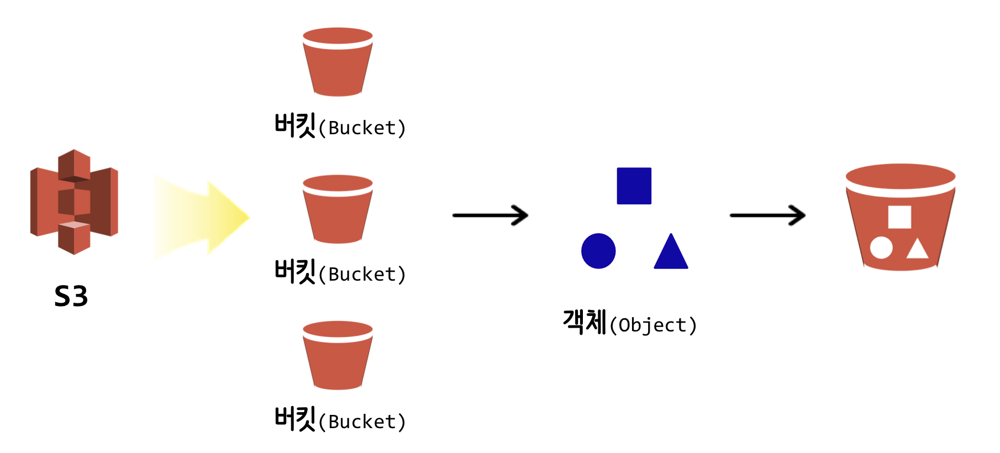

``` {r, include=FALSE}
# source("tools/chunk-options.R")
knitr::opts_chunk$set(echo = TRUE, warning=FALSE, message=FALSE,
                    comment="", digits = 3, tidy = FALSE, prompt = FALSE, fig.align = 'center')
library(reticulate)
use_condaenv("anaconda3")
# reticulate::repl_python()
```

# AWS S3 {#aws-tools-S3}

AWS S3의 정적 웹 사이트 호스팅(`Static Web Site Hosting`) 기능을 활용하여 블로그를 S3에 올릴 수 있다. S3에 대한 비용은 [Amazon S3 요금](https://aws.amazon.com/ko/s3/pricing/)에서 확인할 수 있는데 **S3 Standard 스토리지** 기준 `처음 50TB/월` &rarr; `0.025 USD/GB` 요금이 나와 있다.

# 블로그 웹사이트 {#aws-blogs}

제킬로 개인 블로그를 제작하는 방법에 대해서는 다음 웹사이트를 참고한다.

<style>
div.blue { background-color:#e6f0ff; border-radius: 5px; padding: 10px;}
</style>
<div class = "blue">

- https://statkclee.github.io/ds-authoring/ds-github-blog.html

</div>

# AWS S3 설정 [^S3-blog-setting] {#aws-S3-설정}

[^S3-blog-setting]: [KimJongMin (2017-07-17), "AWS S3를 이용한 웹 호스팅"](https://jongmin92.github.io/2017/07/17/Emily/6-aws-s3-static-web-hosting/)

제작된 블로그를 Github이 아니라 S3에 호스팅을 할 경우 다음 단계를 거친다.

1. S3 버킷 생성
1. 제킬 웹사이트 S3 업로드
1. 버킷 정책(Permission) 설정
1. 버킷 정적 웹 사이트 호스팅 기능 활성화
1. 버킷 Record Set 설정

## S3 버킷 생성 {#aws-bucket-create}

[빅데이터 AWS IAM](https://statkclee.github.io/bigdata/cloud-aws-iam.html)을 참조하여 `awscli`와 `boto3`를 설정하면 AWS를 "프로그래밍형 인프라" 혹은 Infrastructure as Code라고 흔히 부르며 인프라 구성을 마치 소프트웨어를 프로그래밍하는 것처럼 처리하는 것이 가능하다. 먼저 AWS S3, 버킷(Bucket), 객체(Object)에 대한 개념을 살펴보자.



GUI 콘솔을 사용해서 테스트 개념으로 버킷을 하나 생성한다.

## S3 버킷 생성 {#aws-bucket-create}


