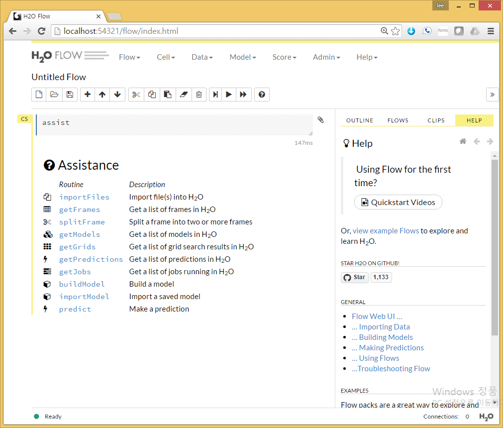
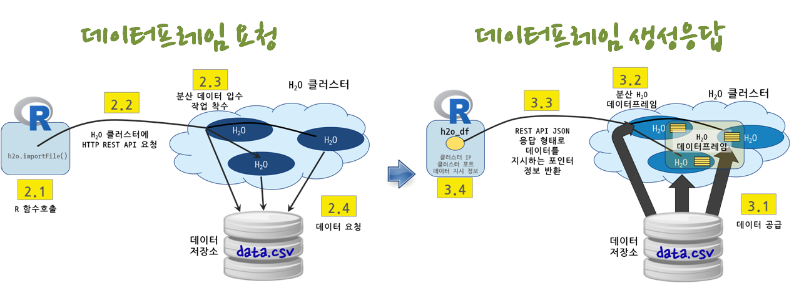
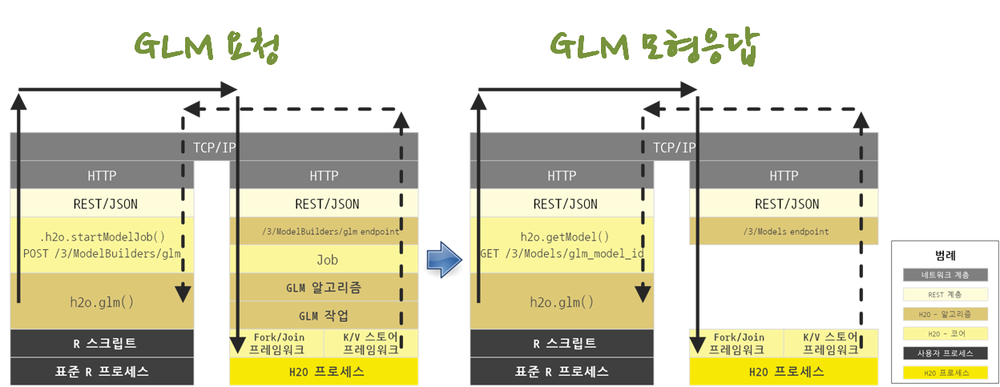

``` {r, include=FALSE}
# source("tools/chunk-options.R")
knitr::opts_chunk$set(echo = TRUE, warning=FALSE, message=FALSE,
                    comment="", digits = 3, tidy = FALSE, prompt = FALSE, fig.align = 'center')
```


# $H_2 O$ 돌려보기 [^h2o-getting-started] {#spark-h2o}

[^h2o-getting-started]: [R Tutorial](http://h2o-release.s3.amazonaws.com/h2o/rel-lambert/5/docs-website/Ruser/rtutorial.html)

$H_2 O$ 헬로 월드를 찍고, $H_2 O$ 클러스터로 데이터를 가져오는 작업과 $H_2 O$ 클러스터와 R 협업 과정을 이해한다.
일반화 선형모형을 $H_2 O$ 클러스터 내 데이터프레임 데이터로 예측모형으로 적용하는 것을 목표로 한다.


## $H_2 O$ 설치 [^h20-r-install] {#spark-h2o-install}

[^h20-r-install]: [Install H2O package in R](http://h2o-release.s3.amazonaws.com/h2o/rel-lambert/5/docs-website/Ruser/Rinstall.html)

R에서 $H_2 O$ 설치는 `install.packages` 명령어를 통해 간단히 구현된다.
만약 기존 $H_2 O$ 팩키지가 설치되어 있다면 제거하고, `install.packages` 명령어로 설치한다.
단순히 `install.packages("h2o")` 설치하고 `h2o.getVersion()` 명령어로 최신 버전이 설치된 것을 확인한다.

``` {r install-h2o, eval=FALSE}
##=========================================================================
## 01. H2O 설치: 
##=========================================================================
# 기존 H2O 제거
# The following two commands remove any previously installed H2O packages for R.
if ("package:h2o" %in% search()) { detach("package:h2o", unload=TRUE) }
if ("h2o" %in% rownames(installed.packages())) { remove.packages("h2o") }

# 새로 깔끔하게 H2O 설치
install.packages("h2o", repos=(c("http://s3.amazonaws.com/h2o-release/h2o/master/1497/R", getOption("repos"))))
library(h2o)
```

만약 자바가 설치되지 않는 경우 다음 명령어를 통해 자바를 설치한다. 64비트 버젼이 필요하다. 32비트 자바가 설치되어 있다면 64비트 버젼으로 새로 설치해야만 된다. 추가로 스파크 의존성이 있기 때문에 [단독형 스파크 설치 - PC/노트북, EC2 원격 컴퓨터](https://statkclee.github.io/bigdata/ds-sparklyr.html) 설치내용도 참조한다.

``` {r install-h2o-shell, eval=FALSE}
$ sudo add-apt-repository -y ppa:webupd8team/java
$ sudo apt-get update
$ sudo apt-get -y install oracle-java8-installer
$ sudo apt-get -y install oracle-java8-set-default
$ java -version
```

## $H_2 O$ 클러스터 생성 {#spark-h2o-cluster}

**로컬 컴퓨터**, **아마존 EC2**, **하둡 서버** 위 어디든 다음 명령어로 $H_2 O$ 인스턴스를 띄울 수 있다.

$H_2 O$ 클러스터가 생성되면, 클러스터 노드 하나를 잡아서 `h2o.init` 명령어로 IP 주소와 포트를 인자로 넘겨 연결을 초기화한다.

``` {r install-h2o-init, eval=TRUE}
library(h2o)
localH2O <- h2o.init(ip = 'localhost', port = 54321, max_mem_size = '4g', nthreads = -1)
h2o.getVersion()
h2o.shutdown()

# h2o.init(nthreads = -1)
```

웹브라우저를 열ㄹ고 `http://localhost:54321/flow/index.html` 주소창에 입력하게 되면 $H_2 O$ FLOW를 사용해서 GUI 방식으로 데이터 분서과 기계학습모형을 제작할 수 있다.



## $H_2 O$ 클러스터 정보확인 {#spark-h2o-info}

`h2o.clusterInfo()` 혹은 `h2o.clusterInfo(localH2O)` 명령어를 통해 구성된 클러스터 정보를 확인한다. 

``` {r install-h2o-info}
h2o.clusterInfo()
```

## 1.3. $H_2 O$ 클러스터 종료 {#spark-h2o-stop}

$H_2 O$ 클러스터를 `h2o.shutdown` 명령어로 종료시킨다.

``` {r install-h2o-shutdown, eval=FALSE}
> h2o.shutdown()
Are you sure you want to shutdown the H2O instance running at http://localhost:54321/ (Y/N)? y
[1] TRUE
```

# $H_2 O$ 데이터 가져오기 {#spark-h2o-import}



`h2o.importFile` 명령어를 HTTP REST API를 통해 $H_2 O$ 클러스터에 전송을 하게 되면 $H_2 O$ 클러스터는 데이터저장소를 찾아 데이터를 요청하게 된다.

다른 특별한 사항이 없다면 데이터 저장소에서 $H_2 O$ 클러스터로 데이터가 공급되고, $H_2 O$ `분산 데이터프레임`이 $H_2 O$ 클러스터에 생성되고, 작업 실행결과가 REST API JSON 응답으로 반환되고, R 내부에는 `h2o_df` 데이터프레임이 생성된다. 하지만, 로컬 컴퓨터 R에는 클러스터 IP, 클러스터 포트, $H_2 O$ 분산 데이터프레임을 지시하는 포인터정보가 보관된다. 


$H_2 O$ 데이터를 가져오는 경우 $H_2 O$에 나온 설명과 차이가 나서 돌아가지 않는 경우가 있다. 활발히 성능개선이 꾸준히 일어나다 보니 문서와 코드가 맞지 않으니 가장 최신 $H_2 O$ 도움말을 참조하거나, 가장 최신 코드를 뜯어보고 사용하면 된다. 늘 오픈소스 소프트웨어를 사용하면 발생되는 사항이니 절대로 당황하지 않는다.

## $H_2 O$ 팩키지에 포함된 데이터 불러오기 {#spark-h2o-import-pkg}

``` {r install-h2o-import}
##=========================================================================
## 02. Data import
##=========================================================================

irisPath <- system.file("extdata", "iris.csv", package="h2o")
iris.hex <- h2o.importFile(path = irisPath,  destination_frame = "iris.hex")
summary(iris.hex, exact_quantiles=TRUE)

irisPath

summary(iris.hex, exact_quantiles=TRUE)
```

## $H_2 O$ 클러스터로 외부 데이터 불러오기 [^flight-csv] {#spark-h2o-import-external}

[^flight-csv]: [Alfredo Serafini (5 Sep 2018), Hacking Airline DataSet with H2O](https://github.com/h2oai/h2o-2/wiki/Hacking-Airline-DataSet-with-H2O)

[항공사 데이터셋(allyear2k.csv)](https://s3.amazonaws.com/h2o-airlines-unpacked/allyears2k.csv) 파일을 다운로드 받아 로컬 컴퓨터 원하는 디렉토리에 저장을 한 후, `h2o.importFile` 명령어로 데이터를 불러온다.

``` {r install-h2o-import-csv}
#-------------------------------------------------------------------------
# 2.2. 외부 CSV 데이터 불러오기
#-------------------------------------------------------------------------

# download.file(url="https://s3.amazonaws.com/h2o-airlines-unpacked/allyears2k.csv", destfile = "data/allyears2k.csv")

pathToAirlines <- normalizePath("data/allyears2k.csv")
airlines.hex <- h2o.importFile(path = pathToAirlines, destination_frame = "airlines.hex")
summary(airlines.hex, exact_quantiles=TRUE)
```

# 3. $H_2 O$ 데이터 정제과정 [^h2o-r-scaling] {#spark-h2o-cleaning}

[^h2o-r-scaling]: [Scaling R with H2O](http://blog.h2o.ai/2015/06/h2o-r-functions/)

`lubridate` 팩키지의 정확한 시간 계산 함수를 사용해서 비행기 출발시간과 도착시간을 계산하여야 하나 편의상 데이터 전처리과정만을 맛보기로 보여주는 $H_2 O$ R 코드는 다음과 같다.

`DepTime`, `ArrTime` 변수에서 나머지를 구하는 연산자 `%%`을 사용하여 전체를 분으로 환산하고, 총합을 빼는 로직으로 비행기 이동시간을 산출한다.

``` {r install-h2o-cleansing}
##=========================================================================
## 03. H2O 데이터 정제 과정
##=========================================================================

## 비행기 출발시간
depHour <- airlines.hex$DepTime %/% 100
depMin <- airlines.hex$DepTime %% 100 ## R 나머지 연산자
depTime <- depHour*60 + depMin

## 비행기 도착시간
arrHour <- airlines.hex$ArrTime %/% 100
arrMin <- airlines.hex$ArrTime %% 100 ## R 나머지 연산자
arrTime <- arrHour*60 + arrMin

## 비행기 이동시간을 계산하여 데이터프레임에 변수로 추가
airlines.hex$airliner_duration <- arrTime - depTime

summary(airlines.hex$airliner_duration, exact_quantiles=TRUE)
```

# $H_2 O$ 일반화 선형모형 적합 {#spark-h2o-glm}



비행기 연착에 대한 예측모형을 개발 할 때 일반화 선형모형 `h2o.glm` 함수를 사용할 경우,
REST API를 통해 JSON을 통해 `POST` 요청을 HTTP, TCP/IP 요청을 보내면 $H_2 O$ 클러스터에서
이를 받아 맵리듀스 작업을 통해 GLM 모형을 분산해서 작업처리하고 이 결과값을 K/V 스토어 프레임워크에서 
그대로 HTTP, TCP/IP 네트워크 계층을 통해 REST API JSON 응답으로 반환한다.

GLM 모형 적합 과정이 끝났기 때문에 `GET` 요청을 통해 GLM 예측모형 결과를 반환해서 볼 수 있다.
이와 같이 $H_2 O$는 계층으로 구분되고 API 호출을 통해 작업이 이루어지는 것을 쉽게 확인할 수 있다.


`h2o.glm` 함수를 통해 일반화 선형모형 적합을 한다. 

``` {r install-h2o-glm}
y <- "IsArrDelayed"
X  <- c("Year", "Month", "DayofMonth", "DayOfWeek", "CRSDepTime", "UniqueCarrier", "Origin", "Dest", 'Distance')
airlines.glm <- h2o.glm(y=y, x=X, training_frame = airlines.hex, family = "binomial", nfolds = 1)

summary(airlines.glm)
```
