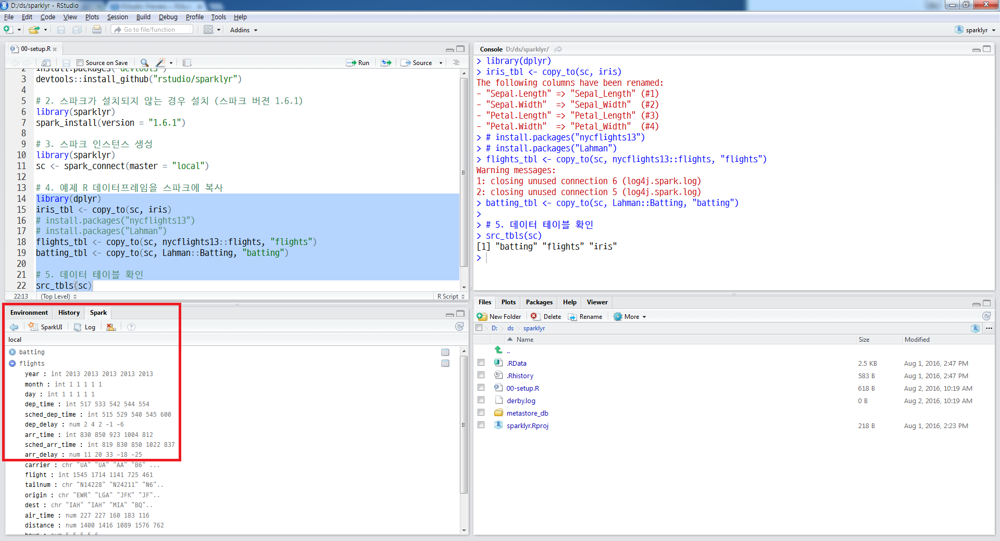

``` {r, include=FALSE}
knitr::opts_chunk$set(echo = TRUE, warning=FALSE, message=FALSE,
                    comment="", digits = 3, tidy = FALSE, prompt = FALSE, fig.align = 'center')
```


# 로컬 컴퓨터 스파크 설치 {#install-spark}

# `sparklyr` 설치 (윈도우) [^sparklyr-windows] {#install-spark-windows}

[^sparklyr-windows]: [Running Apache Spark with sparklyr and R in Windows](http://yokekeong.com/running-apache-spark-with-sparklyr-and-r-in-windows/)

`sparklyr`는 `dplyr`을 스파크 환경에서 사용할 수 있도록 구현된 팩키지다.

<style>
div.blue { background-color:#e6f0ff; border-radius: 5px; padding: 10px;}
</style>
<div class = "blue">

**윈도우 사전 준비**

윈도우 환경에서 `sparklyr`을 설치하려면 [Microsoft Visual C++ 2010 SP1 Redistributable Package](https://www.microsoft.com/en-us/download/details.aspx?id=13523)을 다운로드받아 
설치한다.

</div>


1. [Download Apache Spark](http://spark.apache.org/downloads.html) 사이트를 방문하여 스파크-하둡을 다운로드 한다. 너무 오래된 버전, 가장 최근 버전은 설치과정에 문제가 있을 수 있으니 현재 시점기준("2019-01-01") 약 1년전 버전을 설치한다. `spark-2.3.0-bin-hadoop2.7.tgz`은 하둡 2.7 버전에 스파크 2.3.0 버전을 설치한다는 의미가 된다.
    - 스파크 버젼 2.4.0. : `spark-2.4.0-bin-hadoop2.7.tgz` 버전은 다운로드 받아 설치한다.     
    - **스파크 버젼 2.3.0.** : `spark-2.3.0-bin-hadoop2.7.tgz` 버전은 다운로드 받아 설치한다.
    - 스파크 버젼 1.6.3. : `spark-1.6.3-bin-hadoop2.6.tgz` 버전을 다운로드 받아 설치한다.
1. 다운로드 받은 파일의 압축을 풀게 되면 `spark-2.3.0-bin-hadoop2.7.tgz` 디렉토리가 생성된다.
    * 작업하기 편한 장소로 압축 푼 스파크-하둡 디렉토리를 이동시킨다. 예를 들어, `C:/spark-2.3.0-bin-hadoop2.7`
1. RStudio에서 `sparklyr` 팩키지를 설치한다.

## 자바 설치 [^install-java] {#install-spark-windows-java}

[^install-java]: [Spark 2: How to install it on Windows in 5 steps](https://medium.com/@dvainrub/how-to-install-apache-spark-2-x-in-your-pc-e2047246ffc3)

스파크를 설치하기 위해서 먼저 자바 버전 7+ 이상이 필요하다. 만약 자바가 설치되지 않는 경우 
[자바](https://www.java.com/ko/) 다운로드를 선행하여 진행한다.

```{r spark-windows-java, eval=FALSE}
C:\spark-2.3.0-bin-hadoop2.7>java -version
java version "1.8.0_171"
Java(TM) SE Runtime Environment (build 1.8.0_171-b11)
Java HotSpot(TM) 64-Bit Server VM (build 25.171-b11, mixed mode)
```

## 스파크 헬로월드 {#install-spark-windows-hello-world}

[Download Apache Spark](http://spark.apache.org/downloads.html) 사이트에서 다운로드 받아 압축을 풀게되면 
`C:/spark-2.3.0-bin-hadoop2.7` 스파크 설치는 하둡과 함께 완료되었다.

"제어판 &rarr; 모든 제어판 항목 &rarr; 시스템"에서 "고급 시스템 설정"을 선택하여 "시스템 속성"의 "고급" 탭에서 "환경변수"를 설정한다.

```{r spark-env, eval=FALSE}
SPARK_HOME = C:\spark-2.3.0-bin-hadoop2.7
HADOOP_HOME = C:\spark-2.3.0-bin-hadoop2.7
PATH += C:\spark-2.3.0-bin-hadoop2.7\bin
```

다음으로 `winutils.exe` 파일을 [Windows binaries for Hadoop versions](https://github.com/steveloughran/winutils)을 하둡 버젼에 맞춰 다운로드하여 설치한다.
(복사하여 붙여넣기)

예를 들어, 하둡 2.7버젼이 "C:\spark-2.3.0-bin-hadoop2.7" 디렉토리에 설치되어 있기 때문에 [https://github.com/steveloughran/winutils/blob/master/hadoop-2.7.1/bin/winutils.exe](https://github.com/steveloughran/winutils/blob/master/hadoop-2.7.1/bin/winutils.exe) 파일을 "C:\spark-2.3.0-bin-hadoop2.7\bin" 디렉토리에 복사하여 붙여넣으면 된다.

스파크 설정 후에 발생되는 버그를 미연에 방지하기 위해서 다음 작업수행한다.

1. `c:\tmp\hive` 디렉토리 생성
1. 다운로드 받은 `winutils.exe` 프로그램 실행:  `winutils.exe chmod -R 777 c:\tmp\hive`
1. 권한확인: `winutils.exe ls -F c:\tmp\hive`

### 언어 설치 - 스칼라 {#install-spark-windows-hello-world-language-scala}

가장 먼저 스파크 헬로월드를 보내보자. 이를 위해서 스파크와 의사소통할 수 있는 언어가 필요하다.
스칼라를 스파크 데이터 분석 및 모형개발의 주언어로 설정하고자 할 경우 [스칼라 다운로드](https://www.scala-lang.org/download/) 사이트에서 윈도우 버젼을 다운로드받아 설치한다.

- [Other ways to install Scala: Download the Scala binaries for windows ](https://downloads.lightbend.com/scala/2.12.8/scala-2.12.8.msi)

`C:\Program Files (x86)\scala` 디렉토리에서 스칼라 버젼을 확인해보자.

```{r scala-install, eval=FALSE}
C:\Program Files (x86)\scala>scala -version
Scala code runner version 2.12.8 -- Copyright 2002-2018, LAMP/EPFL and Lightbend
, Inc.
```

### 스파크 쉘(spark-shell) {#install-spark-windows-hello-world-spark-shell}

`C:\Program Files (x86)\scala\doc` 디렉토리에 가면 `README` 파일이 있다.
이문서를 불러와서 단어갯수와 첫 행을 출력하는 코드를 작성한다.
우선 `spark-shell`을 실행시켜 스파크 클러스터를 생성시킨다.
그리고나서 `sc.textFile()` 함수로 `README` 파일을 불러읽어온다.
그리고 나서 `textFile.count()`, `textFile.first()` 함수로 단어갯수와 문서 첫줄을 화면에 찍어본다.

[Spark Quick Start](https://spark.apache.org/docs/1.2.1/quick-start.html)에서 자세한 사항을 확인한다.

``` {r spark-shell-hello-world-spark-shell, eval=FALSE}
C:\Program Files (x86)\scala\doc>ls
LICENSE.md  License.rtf  README  licenses  tools

C:\Program Files (x86)\scala\doc>spark-shell
2019-01-03 14:39:55 WARN  NativeCodeLoader:62 - Unable to load native-hadoop li
rary for your platform... using builtin-java classes where applicable
Setting default log level to "WARN".
To adjust logging level use sc.setLogLevel(newLevel). For SparkR, use setLogLev
l(newLevel).
Spark context Web UI available at http://victorlee-PC1.webzen.co.kr:4040
Spark context available as 'sc' (master = local[*], app id = local-154649400135
).
Spark session available as 'spark'.
Welcome to
      ____              __
     / __/__  ___ _____/ /__
    _\ \/ _ \/ _ `/ __/  `_/
   /___/ .__/\_,_/_/ /_/\_\   version 2.3.0
      /_/

Using Scala version 2.11.8 (Java HotSpot(TM) 64-Bit Server VM, Java 1.8.0_171)
Type in expressions to have them evaluated.
Type :help for more information.

scala> val textFile = sc.textFile("README")
textFile: org.apache.spark.rdd.RDD[String] = README MapPartitionsRDD[3] at text
ile at <console>:24

scala> textFile.count()
res1: Long = 36

scala> textFile.first()
res2: String = Scala Distribution
```

### 언어 - 파이썬 {#install-spark-windows-hello-world-language-python}

파이썬을 설치하고 하나서 `pyspark`를 사용해서도 스파크를 사용하는 것이 가능하다.

``` {r spark-shell-hello-world-python, eval=FALSE}
C:\Program Files (x86)\scala\doc>pyspark
Python 3.6.4 |Anaconda, Inc.| (default, Jan 16 2018, 10:22:32) [MSC v.1900 64 bi
t (AMD64)] on win32
Type "help", "copyright", "credits" or "license" for more information.
2019-01-03 14:46:53 WARN  NativeCodeLoader:62 - Unable to load native-hadoop lib
rary for your platform... using builtin-java classes where applicable
Setting default log level to "WARN".
To adjust logging level use sc.setLogLevel(newLevel). For SparkR, use setLogLeve
l(newLevel).
Welcome to
      ____              __
     / __/__  ___ _____/ /__
    _\ \/ _ \/ _ `/ __/  `_/
   /__ / .__/\_,_/_/ /_/\_\   version 2.3.0
      /_/

Using Python version 3.6.4 (default, Jan 16 2018 10:22:32)
SparkSession available as 'spark'.
>>> nums = sc.parallelize([1,2,3,4])
>>> nums.map(lambda x: x*x).collect()
[Stage 0:>                                                          (0 + 4) / 4]

[1, 4, 9, 16]
>>>
```

### 언어 - R {#install-spark-windows-hello-world-language-R}

`spark_available_versions()` 함수를 사용해서 R에서 설치하는 방법도 있기는 하지만, 
추후 있을 수 있는 디버깅을 고려하여 스파크를 설치하고 환경설정을 마친 후에 `sparklyr` 팩키지를 통해서 R언어로 
빅데이터 분석 및 모형개발 작업을 수행하는 것이 좋은 경우도 많다.

```{r windows-install, eval=TRUE}
library(sparklyr)
# 0. 설정환경 확인
## JAVA 설정
Sys.getenv("JAVA_HOME")
## HADOOP 설정
Sys.getenv("HADOOP_HOME")
## SPARK 설정
Sys.getenv("SPARK_HOME")
spark_home_dir()

## 설치된 SPARK 버젼확인 설정
spark_installed_versions()

# 1. sparklyr 설치
# devtools::install_github("rstudio/sparklyr")

# 2. 스파크 클러스터 로컬에 설치 
# 가능한 설정 확인
# spark_available_versions()
sc <- spark_connect(master="local")

# 3. iris 데이터셋 작업 준비 완료
library(dplyr)
iris_tbl <- copy_to(sc, iris)

src_tbls(sc)
```

# `sparklyr` 설치 유닉스 계열 [^sparklyr] [^install-jdk-on-mac-osx] {#install-spark-unix}

[^sparklyr]: [sparklyr — R interface for Apache Spark](http://spark.rstudio.com/)

유닉스 계열(맥, 리눅스)에서 `sparklyr` 설치는 더욱 쉽다. 
[sparklyr - R interface for Apache Spark](http://spark.rstudio.com/) 안내지침에 따라 명령어를 타이핑하거나 복사하여 붙여 넣으면 된다.

[^install-jdk-on-mac-osx]: [MAC OS X 에 JDK 설치하는 방법](http://ishappy.tistory.com/entry/MAC-OS-X-에-JDK-설치하는-방법)

<style>
div.blue { background-color:#e6f0ff; border-radius: 5px; padding: 10px;}
</style>
<div class = "blue">

**맥 사전 준비**

맥 환경에서 `sparklyr`을 설치하려면 자바를 설치해야 하고, `sparklyr`을 실행할 때 발생하는 자바 오류도 잡아줘야 된다.

</div>

1. 자바 JDK 설치는 `.dmg` 파일을 제공해 주기 때문에 [오라클 자바 다운로드](http://www.oracle.com/technetwork/java/javase/downloads/index.html?ssSourceSiteId=otnjp) 사이트에서 
라이선스 동의를 하고 가장 최신 [jdk-8u111-macosx-x64.dmg](http://download.oracle.com/otn-pub/java/jdk/8u111-b14/jdk-8u111-macosx-x64.dmg) 파일을 다운로드 받아 설치한다.
1. 터미널을 열고 `java -version` 명령어로 버젼을 확인힌다.
1. `cd /Library/Java/JavaVirtualMachines/` 명령어를 통해 JDK가 설치된 디렉토리를 확인한다.
1. `cd jdk1.8.0_111.jdk/Contents/Home/` 명령어로 자바 홈(JAVA_HOME)까지 들어가서 경로를 확인한다.
	- JAVA_HOME 경로를 확인하고 나면 환경변수로 설정을 할 수 있다.
	- `pwd` 명령어로 `/Library/Java/JavaVirtualMachines/jdk1.8.0_111.jdk/Contents/Home` 경로명을 확인한다.
1. `nano ~/.bash_profile` 명령어를 통해 나노 편집기에 `JAVA_HOME`, `JAVA_CPPFLAGS` 환경설정을 하단에 붙여 넣는다.
    - `export JAVA_HOME="/Library/Java/JavaVirtualMachines/jdk1.8.0_111.jdk/Contents/Home"`
    - `export JAVA_CPPFLAGS="/Library/Java/JavaVirtualMachines/jdk1.8.0_111.jdk/include"`
1. `source ~/.bash_profile` 명령어를 통해 변경사항을 바로 적용시킨다.

``` {r install-mac, eval=FALSE}
$ java -version
java version "1.8.0_111"
Java(TM) SE Runtime Environment (build 1.8.0_111-b14)
Java HotSpot(TM) 64-Bit Server VM (build 25.111-b14, mixed mode)
$ cd /Library/Java/JavaVirtualMachines/
JavaVirtualMachines $ ls
jdk1.8.0_111.jdk
JavaVirtualMachines $ cd jdk1.8.0_111.jdk/Contents/Home/
Home $ pwd
/Library/Java/JavaVirtualMachines/jdk1.8.0_111.jdk/Contents/Home
Home $ nano ~/.bash_profile
Home $ source ~/.bash_profile
```

R로 통계분석을 할 때 `JAVA_HOME`을 설정했지만, 오류가 생기는 경우가 있다. [^konlp-error] 이런 경우 
`/Library/Java/JavaVirtualMachines/jdk1.8.0_111.jdk/Contents` 디렉토리 `Info.plist` 파일의 내용을 다음과 같이 변경한다.
자세한 사항은 [Java SE 8 on Mac OS X](https://oliverdowling.com.au/2014/03/28/java-se-8-on-mac-os-x/)을 참조한다.

[^konlp-error]: [KoNLP에서 아래와 같은 에러가 나올 경우 대처 방법](http://freesearch.pe.kr/archives/3081)

``` {r java-error, eval=FALSE}
Home $ pwd
/Library/Java/JavaVirtualMachines/jdk1.8.0_111.jdk/Contents
Contents $ nano Info.plist

# 변경전 
<key>JVMCapabilities</key>
<array>
    <string>CommandLine</string>
</array>
-------------------------------
# 변경후 
<key>JVMCapabilities</key>
<array>
    <string>CommandLine</string>
    <string>JNI</string>
    <string>BundledApp</string>
</array>
```

## R중심 스파크 설치 {#install-spark-unix-rstudio}

`sparklyr` 팩키지 설치과정은 윈도우 설치과정과 대동소이하다.

``` {r rstudio-spark, eval=FALSE}
# 1. sparklyr 팩키지 설치
# install.packages("devtools")
# devtools::install_github("rstudio/sparklyr")
library(sparklyr)

# 2. 스파크가 설치되지 않는 경우 설치
# Connections --> New Connection

# 3. 스파크 인스턴스 생성
sc <- spark_connect(master = "local")

# 4. 예제 R 데이터프레임을 스파크에 복사
library(dplyr)
iris_tbl <- copy_to(sc, iris)
# install.packages("nycflights13")
# install.packages("Lahman")
flights_tbl <- copy_to(sc, nycflights13::flights, "flights")
batting_tbl <- copy_to(sc, Lahman::Batting, "batting")

# 5. 데이터 테이블 확인
src_tbls(sc)
# [1] "batting" "flights" "iris"  
```

## `sparklyr` RStudio 활용 {#sparklyr-rstudio}

`sparklyr` RStudio 에서 편한게 사용할 수 있도록 다양한 기능을 제공하고 있다. 이를 위해서 [RStudio v0.99.1273 Preview](https://www.rstudio.com/products/rstudio/download/preview/) 버젼을 다운로드해서 설치한다. **Spark** 탭이 별도로 생성되고 이를 통해 스파크에 대한 전반적인 상황을 확인할 수 있다.



## 쉘중심 스파크 설치 [^mac-spark] {#install-spark-unix-rstudio-shell}

[^mac-spark]: [Dataengineering (13 MAR 2017), "OS X에서 Homebrew로 Spark, Zeppelin 설치하기"](http://swalloow.github.io/spark-zeppelin-install)

`brew install` 명령어를 실행시켜 스칼라와 스파크를 순차적으로 설치하고 경로명을 `.bash_profile` 파일에 반영시켜 저장한다.

``` {r mac-spark, eval=FALSE}
$ brew install scala
$ brew install apache-spark
$ spark-shell
2019-01-03 15:35:19 WARN  NativeCodeLoader:62 - Unable to load native-hadoop library for your platform... using builtin-java classes where applicable
Setting default log level to "WARN".
To adjust logging level use sc.setLogLevel(newLevel). For SparkR, use setLogLevel(newLevel).
Spark context Web UI available at http://192.168.91.204:4040
Spark context available as 'sc' (master = local[*], app id = local-1546497324303).
Spark session available as 'spark'.
Welcome to
      ____              __
     / __/__  ___ _____/ /__
    _\ \/ _ \/ _ `/ __/  _/
   /___/ .__/\_,_/_/ /_/\_\   version 2.4.0
      /_/
         
Using Scala version 2.11.12 (Java HotSpot(TM) 64-Bit Server VM, Java 1.8.0_111)
Type in expressions to have them evaluated.
Type :help for more information.

scala> 
```


# AWS 클라우드 스파크 설치 [^ec2-standalone-ec2] {#aws-ec2-spark}

[^ec2-standalone-ec2]: [Using Spark Standalone Mode and S3](https://spark.rstudio.com/example-s3.html)

## 우분투 자바 설치 [^aws-ubuntu-java] {#aws-ec2-java}

[^aws-ubuntu-java]: [How To Install Java with Apt-Get on Ubuntu 16.04](https://www.digitalocean.com/community/tutorials/how-to-install-java-with-apt-get-on-ubuntu-16-04)

준비한 AWS EC2 인스턴스 `ssh`를 통해 `ubuntu` 계정으로 로그인한후 자바를 설치한다. 
`JDK`는 `JRE`를 포함하고 있어서 `sudo apt-get install default-jdk` 를 통해 함께 설치하는 것을 권장한다.
그런 경우는 없겠지만, 여러버젼의 자바가 설치된 경우 `sudo update-alternatives --config java` 명령어를 통해 다양한 자바 버젼을 관리한다.

``` {r eval=FALSE}
$ sudo apt-get update
$ # sudo apt-get install default-jre 
$ sudo apt-get install default-jdk # JDK는 JRE를 포함 
```

다음으로 `JAVA_HOME`을 설정하는데 `sudo update-alternatives --config java` 명령어로 나온 자바홈 경로를 복사해서 `sudo nano /etc/environment` 에 붙여넣는다.
`JAVA_HOME="/usr/lib/jvm/java-8-openjdk-amd64"` 마지막으로 `source /etc/environment` 명령어로 변경사항을 적용시킨다.

``` {r eval=FALSE}
$ sudo update-alternatives --config java
There is only one alternative in link group java (providing /usr/bin/java): /usr/lib/jvm/java-8-openjdk-amd64/jre/bin/java
Nothing to configure.
$ sudo nano /etc/environment
$ source /etc/environment
$ echo $JAVA_HOME
/usr/lib/jvm/java-8-openjdk-amd64/jre/bin/java
```

<style>
div.blue { background-color:#e6f0ff; border-radius: 5px; padding: 10px;}
</style>
<div class = "blue">

**JAVA_HOME 찾는 방법** [^java-home]

> Error in get_java(throws = TRUE) : 
>  Java is required to connect to Spark. JAVA_HOME is set but does not point to a valid version. 
>  Please fix JAVA_HOME or reinstall from: https://www.java.com/en/

상기와 같이 JAVA_HOME 관련 오류가 발생되는 경우 조치 방법은 다음과 같다.

1. `find /usr/lib/jvm/java-1.x.x-openjdk`
1. `sudo nano /etc/environment`
1. JAVA_HOME="/usr/lib/jvm/java-8-openjdk-amd64" 추가
1. source /etc/environment

</div>

[^java-home]: [How to set JAVA_HOME in Linux for all users](https://stackoverflow.com/questions/24641536/how-to-set-java-home-in-linux-for-all-users)

## 스파크 설치 {#aws-ec2-spark-install}

[Download Apache Spark™](https://spark.apache.org/downloads.html) 사이트를 방문하여 아파치 스파크를 다운로드 한다. 물론 스파크내부에 하둡도 같이 포함되어 있는 것을 다운로드 받으면 편리하다.
`tar xvf` 명령어로 압축을 풀고 나서 스파크가 설치된 환경변수 디렉토리를 기억해 둔다. 

``` {r eval=FALSE}
$ wget http://d3kbcqa49mib13.cloudfront.net/spark-2.1.0-bin-hadoop2.7.tgz
$ tar xvf spark-2.1.0-bin-hadoop2.7.tgz
$ cd spark-2.1.0-bin-hadoop2.7
$ pwd
/home/rstudio/spark-2.1.0-bin-hadoop2.7
```

## RStudio 스파크 환경설정 {#aws-ec2-sparklyr}

`SPARK_HOME =` 디렉토리 설정을 맞춰주면 스파크를 `sparklyr` 명령어를 통해 활용이 가능하다.
[EC2 인스턴스 사양](https://aws.amazon.com/ko/ec2/pricing/on-demand/)에 맞춰 스파크 클러스터 환경을 `spark_config()`에 맞춰 설정한다. 

- 하드웨어 사양: M4 Double Extra Large [^ec2-instance-info]
    - m4.2xlarge  
    - 메모리: 32.0 GiB
    - CPU: 8 vCPUs 
    - 가격(On Demand): $0.492 hourly   
    - 가격(Reserved): $0.294 hourly

[^ec2-instance-info]: [EC2Instances.info - Easy Amazon EC2 Instance Comparison](http://www.ec2instances.info/)

- 환경설정 시 유용한 명령어
    - spark_home_dir()
    - spark_installed_versions()

`org.apache.hadoop:hadoop-aws:2.7.3` 팩키지는 AWS S3 연결에 필요한 팩키지가 된다.
`nycflights13`, `Lahman` 팩키지 R 데이터프레임을 스파크 클러스터에 넣어 스파크에서 데이터를 분석한다. 
데이터프레임을 스파크 클러스터에 던질 때 사용하는 `copy_to()` 명령어를 사용하여 스파크 분산 환경에서 데이터를 처리한다.
정반대로 스파크 클러스터에서 꺼내 데이터프레임에서 분석하는 것이 `collect()` 명령어를 사용하는 것이다.

``` {r install-sparklyr, eval=FALSE}
# 1. 환경설정 ------------------------------------
library(sparklyr)
library(tidyverse)
# install.packages("nycflights13")
# install.packages("Lahman")

Sys.setenv(SPARK_HOME = '/home/rstudio/spark-2.1.0-bin-hadoop2.7')
Sys.setenv(JAVA_HOME = '/usr/lib/jvm/java-8-openjdk-amd64')

config <- spark_config()
config$sparklyr.defaultPackages <- "org.apache.hadoop:hadoop-aws:2.7.3"
config$sparklyr.cores.local <- 6
config$spark.driver.memory <- "30G"

sc <- spark_connect(master = "local", config = config, spark_home=spark_home_dir(version = "2.1.0"))

# 2. 예제 R 데이터프레임을 스파크에 복사 ------------

iris_tbl <- copy_to(sc, iris)
flights_tbl <- copy_to(sc, nycflights13::flights, "flights")
batting_tbl <- copy_to(sc, Lahman::Batting, "batting")

# 3. 데이터 테이블 확인 -----------------------------
src_tbls(sc)
df <- collect(iris)
```

## `.csv` 파일 스파크 분석 {#aws-csv-sparklyr}

AWS S3 저장소에 데이터를 저장해서 활용하고, 스파크 클러스터를 별도 EC2 인스턴스로 묶어 
데이터를 분석하는 것이 많이 활용되는 패턴 중 하다.
특히 S3를 `s3fs`로 EC2와 동기화(sync)한 경우 마치 로컬 파일처럼 접근해서 데이터를 분석하는 것도 가능하다.


``` {r read-csv-with-sparklyr, eval=FALSE}
# 4. 로컬 CSV 파일 불러오기 -------------------------

flights <- spark_read_csv(sc, "flights_spark", 
                          path =  "~/works/GF/spark/data/", 
                          memory = TRUE, 
                          columns = list(
                            Year = "character",
                            Month = "character",
                            DayofMonth = "character",
                            DayOfWeek = "character",
                            DepTime = "character",
                            CRSDepTime = "character",
                            ArrTime = "character",
                            CRSArrTime = "character",
                            UniqueCarrier = "character",
                            FlightNum = "character",
                            TailNum = "character",
                            ActualElapsedTime = "character",
                            CRSElapsedTime = "character",
                            AirTime = "character",
                            ArrDelay = "character",
                            DepDelay = "character",
                            Origin = "character",
                            Dest = "character",
                            Distance = "character",
                            TaxiIn = "character",
                            TaxiOut = "character",
                            Cancelled = "character",
                            CancellationCode = "character",
                            Diverted = "character",
                            CarrierDelay = "character",
                            WeatherDelay = "character",
                            NASDelay = "character",
                            SecurityDelay = "character",
                            LateAircraftDelay = "character"), 
                          infer_schema = FALSE)

tidy_flights <- tbl(sc, "flights_spark") %>%
  mutate(ArrDelay = as.integer(ArrDelay),
         DepDelay = as.integer(DepDelay),
         Distance = as.integer(Distance)) %>%
  filter(!is.na(ArrDelay)) %>%
  select(DepDelay, ArrDelay, Distance) %>%
  sdf_register("tidy_spark")

tbl_cache(sc, "tidy_spark")

tbl(sc, "tidy_spark") %>% tally

simple_model <- tidy_flights %>%
  ml_linear_regression(DepDelay~.)

summary(simple_model)

spark_disconnect(sc)
```


