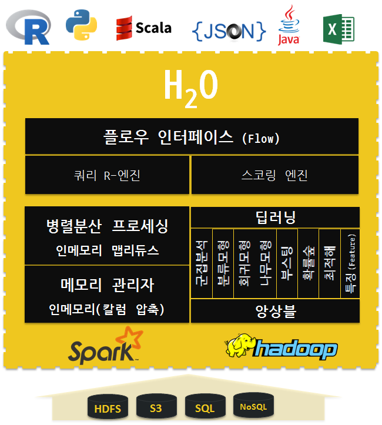
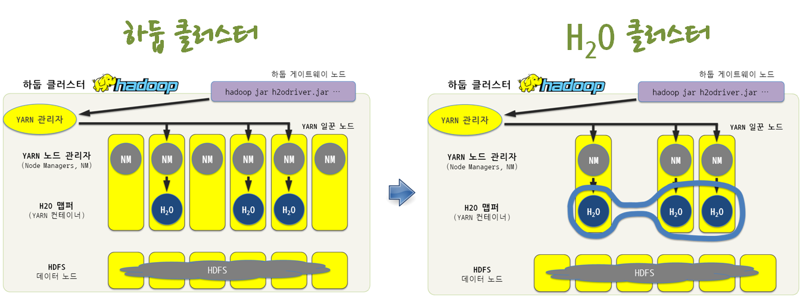
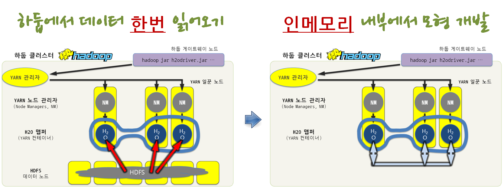
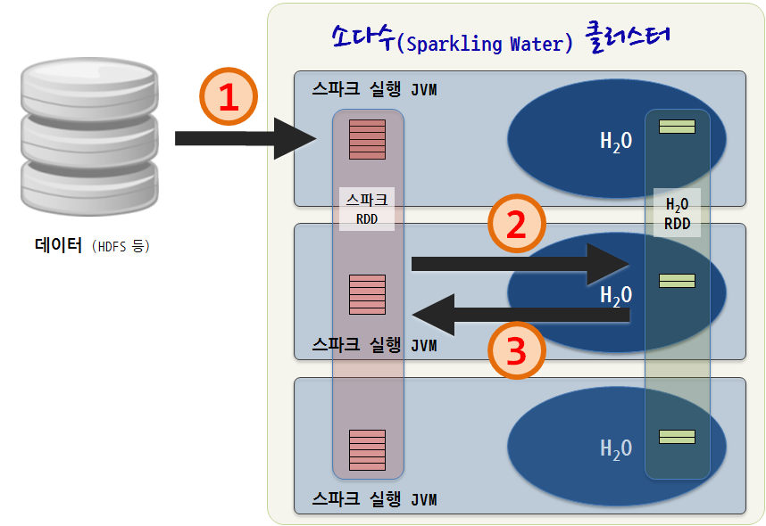
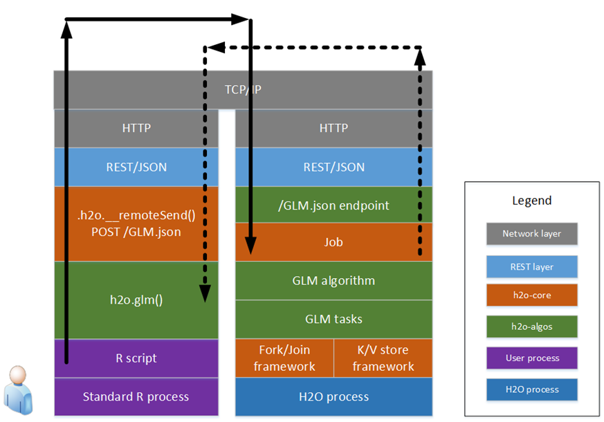
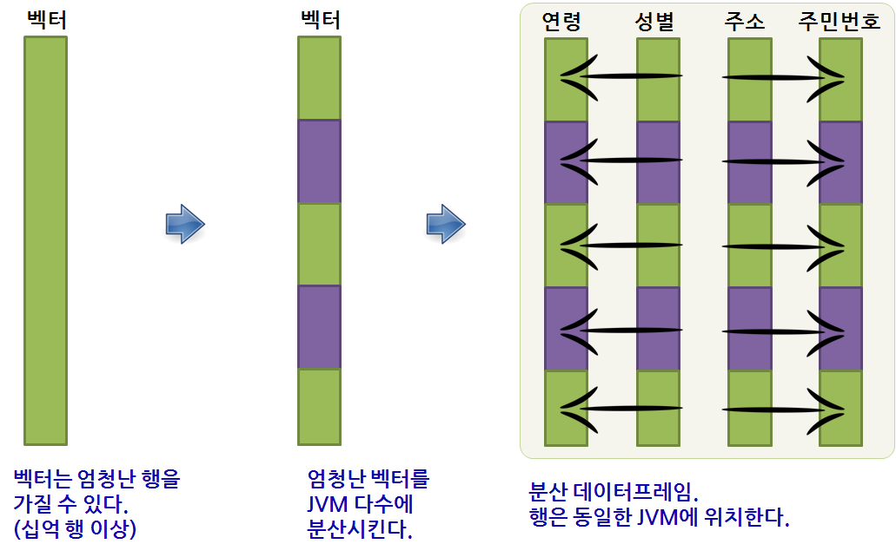

``` {r, include=FALSE}
# source("tools/chunk-options.R")
knitr::opts_chunk$set(echo = TRUE, warning=FALSE, message=FALSE,
                    comment="", digits = 3, tidy = FALSE, prompt = FALSE, fig.align = 'center')
```


# [$H_2 O$ 아키텍쳐](http://h2o-release.s3.amazonaws.com/h2o/rel-noether/4/docs-website/developuser/h2o_stack.html) {#h2o-architecture}

$H_2 O$ 기계학습 패러다임과 하둡 클러스터와 $H_2 O$ 클러스터 차이 및 스파크와 $H_2 O$가 결합된 소다수(Sparkling Water) 클러스터를 이해한다.

$H_2 O$는 REST API 클라이언트를 통해 네트워크를 통해 자바로 구성된 $H_2 O$ JVM과 통신한다.

REST API 클라이언트는 R, 파이썬, 자바스크립트 등으로 구성되고 $H_2 O$ JVM에 기계학습, 데이터 전처리, 데이터 분석, 모형개발에 관련된 명령어를 실어 나른다. 

쥬리터와 유사한 웹인터페이스를 플로우(flow)를 통해 제공하고, 그 내부에 병렬분산 프로세싱을 위한 인메모리 맵리듀스 데이터 처리 기능과 데이터 인메모리 관리 기능을 키-값(key-value)을 통해 제공한다.

딥러링, 배깅과 부스팅 등 다양한 앙상블 모형을 제공하고, 분산된 자료 처리를 위해 스파크와 하둡을 기반으로 하고 있으며, 실제 데이터는 HDFS, S3, SQL, NoSQL을 통해 불러 읽어온다.


<style>
div.blue { background-color:#e6f0ff; border-radius: 5px; padding: 10px;}
</style>
<div class = "blue">

**$H_2 O$ 핵심 계층**

$H_2 O$ 아키텍쳐는 계층 아키넥쳐를 충실히 따르고 있으며, 각 계층은 최고의 기술적 구성요소를 채택하고 있다.

1. 인메모리 분산 K/V 계층 (In-memory Distributed K/V Store Layer): 지연연산을 하지 않는 인메모리 키-값 저장(K/V Store) 모형을 따르고 있고, 메모리 모형은 정확히 자바 메모리 모형이지만, 분산된 자바 메모리 모형이다. `NonBlockingHashMap`으로 약 150ns 속도가 나온다. 
1. 경량 맵리듀스 계층(Light-weight Map/Reduce Layer): 맵리듀스가 병렬 코드를 작성하는 멋진 방법으로 맵리듀스 작업을 통해 작은 데이터는 POJO(Plain Old Java Object)와 빅데이터 $H_2 O$ 분산 배열의 조합으로 표현된다.
1. 초벌 알고리즘 계층 (Pre-Baked Algorithms Layer): $H_2 O$ 에는 최적화되고, 전체 기능이 충분히 갖춘 알고리즘이 다수 포함되어 있다. 일반화 선형모형, 딥러닝, 확률숲, Gradient Boosted machine, PCA, K-Means 등을 들 수 있고, 오차 행렬이 포함되어 알고리즘 성능을 바로 평가할 수 있다.
1. REST/JSON/R/파이썬/엑셀/REPL: REST API 호출과 JSON 응답을 통해 파이썬/R, 심지어 엑셀까지도 클라이언트로 작업이 가능하고, 웹 인터페이스도 지원해서 가벼운 작업은 가볍게 처리가 가능하다.

</div>




## 하둡 클러스터에서 $H_2 O$ 클러스터로... {#h2o-architecture-cluster}

`hadoop -jar h2odriver.jar` 명령어로 하둡 게이트웨어 노드로 진입을 하게 되면 Yarn 관리자를 통해 노드 관리자 중 일부가 $H_2 O$ 노드를 할당하게 된다. 이것이 $H_2 O$ 클러스터를 구성하게 된다.



## 하둡 데이터와 인메모리 모형  {#h2o-architecture-in-memory}

$H_2 O$ 클러스터가 구성되면 HDFS에서 데이터를 **한번** 읽어 오게 된다. 그리고 나서 인메모리 내부에서 모형을 개발하게 된다. 



## 소다수(Sparkling water) 클러스터 {#h2o-architecture-sparkling} 

스파크와 $H_2 O$를 결합한 소다수(Sparkling water) 클러스터는 HDFS에서 데이터를 불러 읽어오면 스파크가 돌고 있는 각 JVM을 묶어 스파크 RDD를 구성하게 되고, $H_2 O$ RDD와 통신을 통해 작업을 수행하게 된다. 이를 통해 마치 하나의 데이터프레임처럼 보이게 되고, R에서 이용가능한 다양한 기계학습 모형을 인메모리에서 빠르게 대용량 데이터에도 문제 없이 작업을 진행하게 된다.



# $H_2 O$ 일반화 선형모형 {#h2o-architecture-glm}

R 스크립트에서 `glm` 일반화 선형모형을 실행시키면 REST API/JSON 응답을 위해 HTTP, TCP/IP 통신계층을 거쳐 $H_2 O$ 클러스터에 작업이 실행되고 결과가 역으로 HTTP, TCP/IP 통신계층을 통해 REST API/JSON 응답으로 돌아온다.



일반화 선형모형은 일반적으로 길고 얇은 데이터 구조에 적합한 모형이다. 이를 분산처리하기 위해서 벡터를 JVM 다수에 쪼개 분산처리하는데, 행은 동일한 JVM 위치시켜 분산처리한다. 



## 표준 R과 $H_2 O$ 클러스터 비교 [^h2o-r-scaling] {#h2o-architecture-comparison}

[^h2o-r-scaling]: [Scaling R with H2O](http://blog.h2o.ai/2015/06/h2o-r-functions/)

표준 R 주요 기능과 $H_2 O$ 자바 클러스터를 표로 정리하면 다음과 같다.

|      구분       |            표준 R           |          $H_2 O$ R          |
|-----------------|-----------------------------|-----------------------------|
| 데이터 불러오기 | `read.csv`, `read_csv` 등   | `h2o.importFile`            |
| 데이터 요약     | `summary`                   | `summary`, `h2o.summary`    |
| 행과 열 결합    | `cbind`, `rbind`            | `h2o.cbind`, `h2o.rbind`    |
| 단항, 이진 연산 | `+`,`-`,`*`,`/`,`^`,`%%`,`%/%` 등 | `+`,`-`,`*`,`/`,`^`,`%%`,`%/%` 등 |
| 일반화 선형모형 | `glm`, `glmnet`             | h2o.glm                     |
| 모형으로 예측   | `predict`                   | `h2o.predict`               |
| 주요 측정치     | `auc`, `mse`, `logLoss` 등  | `h2o.auc`, `h2o.mse`, `h2o.logloss` |
