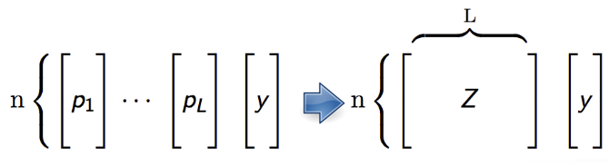

> ## 학습 목표 {.objectives}
>
> * $H_2 O$ 앙상블 모형을 이해한다.
> * 슈퍼학습기에 대한 전반적인 의미를 이해한다.
> * 캐글 신용데이터를 통해 2년내 신용불량 위험을 예측한다.

### 1. 앙상블 모형 [^h2o-ensemble]

[^h2o-ensemble]: [Ensembles - Stacking, Super Learner](http://learn.h2o.ai/content/tutorials/ensembles-stacking/)

앙상블 모형은 배깅, 부스팅, 스택쌓기 등 다양한 모형조합 알고리즘이 존재한다. 

|       앙상블 모형      |              특징                                 |
|------------------------|---------------------------------------------------|
|     배깅(Bagging)      | * 분산을 줄이고, 정확도를 향상                    |
|                        | * 이상치와 잡음이 있는 데이터에 강건              |
|                        | * 흔히 의사결정나무(Decision Tree)와 함께 사용, 즉 확률숲(Random Forest) |
|------------------------|---------------------------------------------------|
|    부스팅(Boosting)    | * 분산을 줄이고, 정확도를 향상                    |
|                        | * 이상치와 잡음이 있는 데이터에 강건하지 않음     |
|                        | * 유연성 -- 어떤 유형의 손실함수와 함께 사용가능  |
|------------------------|---------------------------------------------------|
|   스택쌓기(Stacking)   | * 강력한 성능을 갖는 다양한 분류학습기를 앙상블로 조합 |
|                        | * "메타학습기(metalearner)" 알고리즘을 사용하여 다음 수준 기계학습을 통해 기초 학습기에 대한 최적의 조합을 찾아내도록 학습. |

**슈퍼학습기(Super learner)** 는 버클리 통계학과 교수 Mark van der Laan가 2007년 발표한 논문에 뿌리를 두고 있다.
물론 그 이전에 관련된 연구를 지속적으로 진행하였으며, 슈퍼학습기가 점근적으로 최적 조합이라는 것을 증명한 이론적 토대를 제공했으며 2010년 첫 R 코드로 구현되었고, [SuperLearner - Super Learner Prediction](https://cran.r-project.org/web/packages/SuperLearner/index.html), [tlme](https://cran.r-project.org/web/packages/tmle/index.html)로 CRAN에서 설치가능하다.

슈퍼학습기 이전에 David H. Wolpert가 1992년 **Stacked Generalization** 으로 메타학습기를 통한 스택쌓기를 처음 공식화했고, Leo Breiman 교수가 1996년 **Stacked Regressions** 을 제안했고, 이 연구결과가 슈퍼학습기로 이어졌다.

### 2. 슈퍼학습기 알고리즘

**"수준 0(Level-zero)"** 데이터는 전통적인 통계모형에 사용된 데이터 형태로 이해하면 쉽다.
즉, 설계행렬 $X$와 종속변수 $y$로 모형 모수와 함께 기본 학습기를 지정한다. 필요하면 다른 알고리즘을 지정해서 메타 학습기를 지정하기도 한다. 그리고 나서 k-집단 교차타당도를 기본학습기에 적용하여 성능을 평가한다.

**"수준 1(Level-One)"** 데이터는 k-집단 교차타당도를 적용한 기본학습기에서 나온 예측값을 수집한다.
이를 칼럼마다 모아 새로운 설계 행렬 $Z$를 생성한다. $Z$, $y$를 사용해서 메타학습기를 훈련시켜 최적 모형을 개발한다.

슈퍼학습기는 교차타당도를 통해 다른 모수를 갖는 다양한 모형을 명세하여 모형선택과정을 거친다는 점에서 격자탐색(Grid Search)과 임의탐색(Random Search) 과정을 거치는 모수 미세조정, 모수 탐색 방법론과 맥을 함께 한다.
하지만, 메타러닝 단계로 알려진 슈퍼학습기 알고리즘 후반부는 또다른 모형을 하나 생성한다는 점에서 차별점이 있다.
 
### 3. 캐글 신용점수 사례

[캐글, Give Me Some Credit](https://www.kaggle.com/c/GiveMeSomeCredit) 데이터로 신용을 제공한 후 2년안에 누가 신용불량자로 될 확률이 높은지 예측하는 대회다.

#### 3.1. $H_2 O$ 클러스터 및 환경설정

1. `h2o` 팩키지와 `h2oEnsemble` 팩키지를 설치하고, $H_2 O$ 클러스터를 생성한다.
1. $H_2 O$ 클러스터를 `nthreads = -1` 최대 코어수와 `max_mem_size = '8g'` 최대 메모리 8G를 설정하고 생성한다.

~~~ {.r}
##=========================================================================
## 01. H2O 설치: http://learn.h2o.ai/content/tutorials/ensembles-stacking/
##=========================================================================
# 1. 기존 H2O 제거
if ("package:h2o" %in% search()) { detach("package:h2o", unload=TRUE) }
if ("h2o" %in% rownames(installed.packages())) { remove.packages("h2o") }

# 2. H2O 의존성 설치
pkgs <- c("methods","statmod","stats","graphics","RCurl","jsonlite","tools","utils")
for (pkg in pkgs) {
  if (! (pkg %in% rownames(installed.packages()))) { install.packages(pkg) }
}

# 3. H2O 설치
install.packages("h2o", repos=(c("http://s3.amazonaws.com/h2o-release/h2o/master/1497/R", getOption("repos"))))

# 4. h2o-ensemble 팩키지 설치
#library(devtools)
#install_github("h2oai/h2o-3/h2o-r/ensemble/h2oEnsemble-package")
install.packages("https://h2o-release.s3.amazonaws.com/h2o-ensemble/R/h2oEnsemble_0.1.8.tar.gz", repos = NULL)

#-------------------------------------------------------------------------
# 01.1. H2O 클러스터 환경설정
#-------------------------------------------------------------------------

library(h2o)
library(h2oEnsemble)  # This will load the `h2o` R package as well
h2o.init(nthreads = -1, ip = 'localhost', port = 54321, max_mem_size = '8g')  # H2O 클러스터를 최대 코어수에 맞춰 생성 
h2o.removeAll() # Clean slate - just in case the cluster was already running
# 작업 종료후 h2o 클러스터 종료 명령어
#h2o.shutdown()
~~~

#### 3.2. 캐글 신용평가 데이터 준비

[Give Me Some Credit](https://www.kaggle.com/c/GiveMeSomeCredit/data) 데이터 다운로드 사이트로 이동해서 `cs-training.csv` (7.21 MB) 데이터를 다운로드 받는다.

그리고, 종속변수 2년내 신용불량 여부가 `SeriousDlqin2yrs` 변수에 저장되어 있으니 이를 종속변수로 두고, 나머지를 독립변수로 설정한다.

별도 데이터 변환 및 정제 과정은 생략한다.

~~~ {.r}
##=========================================================================
## 02. H2O 데이터 가져오기
##=========================================================================

train <- h2o.importFile(path = normalizePath("~/kaggle-credit/cs-training.csv"))

y <- "SeriousDlqin2yrs"
x <- setdiff(names(train), y)

train[,y] <- as.factor(train[,y])  

##=========================================================================
## 03. H2O 데이터 정제 과정
##=========================================================================

# 별도 정제 및 변환과정 생략
~~~

#### 3.3. 슈퍼학습기 모형 적합

일반화 선형모형(GLM), 확률숲(RF), Gradient Boosting Machine, 딥러닝(DL)을 기본 학습기로 두고, 2차 메타학습기로 일반화 선형모형(GLM)을 두는 슈퍼학습기 모형을 설정하고 $H_2 O$ 클러스터에서 신용불량 예측모형을 개발한다. 

~~~ {.r}
##=========================================================================
## 04. 슈퍼 학습기
##=========================================================================

learner <- c("h2o.glm.wrapper", "h2o.randomForest.wrapper", 
             "h2o.gbm.wrapper", "h2o.deeplearning.wrapper")
metalearner <- "h2o.glm.wrapper"

fit <- h2o.ensemble(x = x, y = y, 
                    training_frame = train, 
                    family = "binomial", 
                    learner = learner, 
                    metalearner = metalearner,
                    cvControl = list(V = 5))

pred <- predict(fit, train)
predictions <- as.data.frame(pred$pred)[,3]  #third column is P(Y==1)
labels <- as.data.frame(train[,y])[,1]
~~~

#### 3.4. 슈퍼학습기 모형 평가

`cvAUC` 팩키지를 통해 AUC 면적을 최대화한 개별 모형성능을 살펴본다.
가장 성능이 좋게 나온 것은 확률숲(randomForest)으로 거의 1에 수렴하는 0.985가 나온다.

~~~ {.r}
library(cvAUC)
L <- length(learner)
auc <- sapply(seq(L), function(l) cvAUC::AUC(predictions = as.data.frame(pred$basepred)[,l], labels = labels)) 
data.frame(learner, auc)
~~~

~~~ {.output}
                   learner       auc
1          h2o.glm.wrapper 0.6987710
2 h2o.randomForest.wrapper 0.9850741
3          h2o.gbm.wrapper 0.8410525
4 h2o.deeplearning.wrapper 0.8215124
~~~

슈퍼학습기를 통해 두번째 모형을 돌린 결과 성능이 0.965로 확률숲보다 약간 떨어지는 것으로 나온다. 생각해보면 기본 학습기 중 일반화 선형모형의 AUC가 0.698로 낮은 것도 설명이 가능한 것으로 보인다.

~~~ {.r}
cvAUC::AUC(predictions = predictions, labels = labels)
~~~

~~~ {.output}
[1] 0.9652024
~~~

